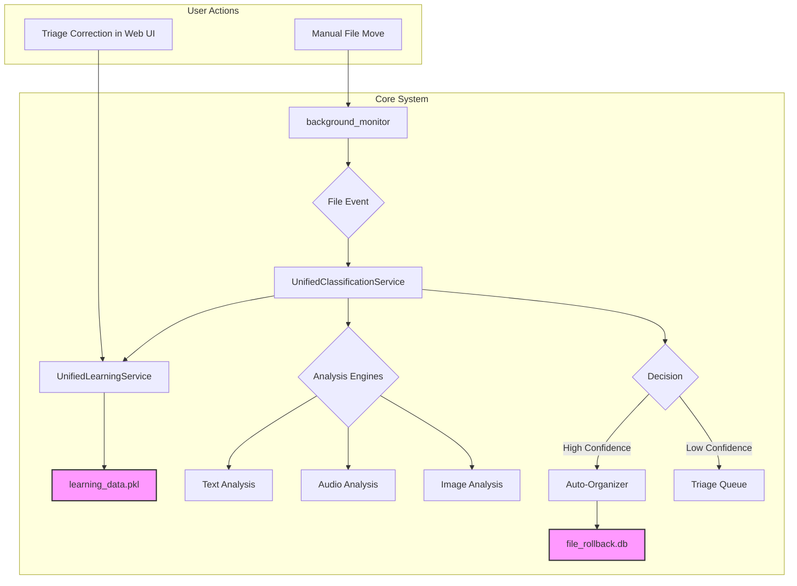

# System Architecture: The Unified Adaptive Learning System

This document describes the target architecture for the AI File Organizer. The central principle is a single, intelligent core that learns from the user and automates file management across all file types.

## Core Components

### 1. The Unified Learning Service
-   **Purpose:** To act as the system's central "memory" and "brain."
-   **Mechanism:** Manages a single `learning_data.pkl` file.
-   **Learning Vectors:**
    -   **Active Learning:** Receives explicit corrections from the `TriageService` when the user re-classifies a file in the web UI.
    -   **Passive Learning:** Receives implicit corrections from the `background_monitor` when it detects the user has manually moved a file from one managed category folder to another.

### 2. The Unified Classification Service
-   **Purpose:** To provide a single point of entry for classifying any file.
-   **Mechanism:**
    1.  Receives a file path.
    2.  Queries the `UnifiedLearningService` for historical context on similar files.
    3.  Detects the file type (MIME type).
    4.  Routes the file to the appropriate **Analysis Engine**:
        *   **Text Engine:** Uses the `ContentExtractor` to get text, then performs keyword and semantic analysis.
        *   **Audio Engine:** Uses the `librosa` and `openai` logic transplanted from the `AI-Audio-Organizer` project to analyze spectral data and get AI-driven classification.
        *   **Image Engine:** A future module for computer vision.
    5.  Blends the analysis result with the historical context from the learning service to produce a final classification and confidence score.

### 3. The Proactive Workflow (`background_monitor`)
-   **Purpose:** To automate the entire organization process.
-   **Mechanism:**
    1.  Detects a new file in a monitored directory (e.g., `Downloads`).
    2.  After a 7-day grace period, it begins processing.
    3.  **Deduplication:** It first calls the `BulletproofDeduplicator` to check if the file is a duplicate. If so, the file is handled accordingly, and the process stops.
    4.  **Classification:** It sends the file to the `UnifiedClassificationService`.
    5.  **Action:**
        *   If confidence is high, it uses the classification result to generate a new, intelligent filename and moves the file to the correct directory.
        *   If confidence is low, it moves the file to a "Needs Review" location and adds it to the Triage queue for the web UI.
    6.  **Logging:** Every move or rename is logged to the `file_rollback.db` via the `EasyRollbackSystem`.

This architecture ensures that all parts of the system work in concert, guided by a central intelligence that constantly learns from the user.