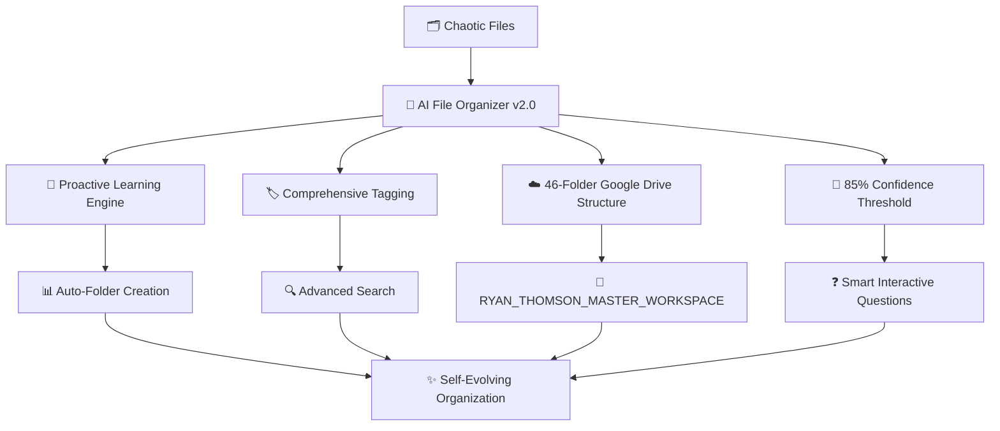
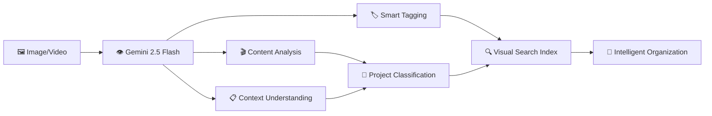
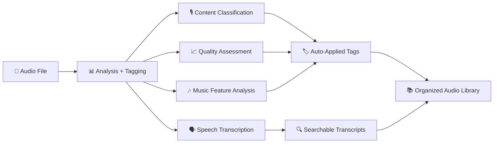
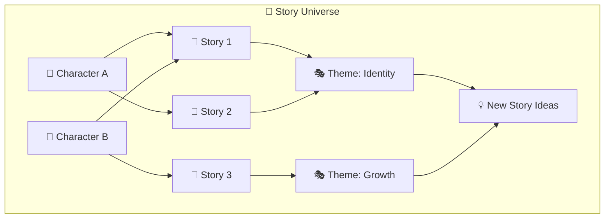
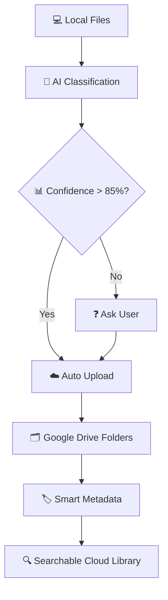
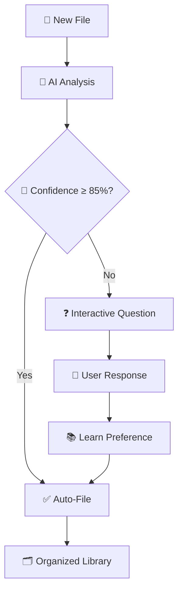
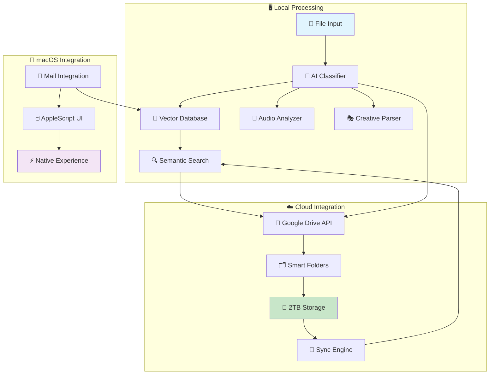
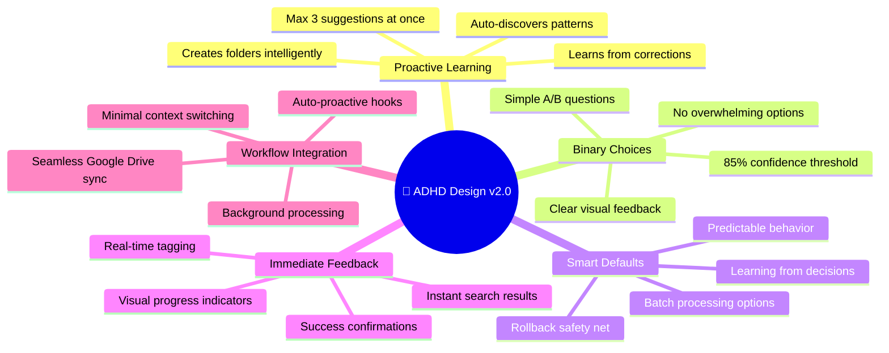

<<<<<<< HEAD
# AI File Organizer v3.2

[](https://smithery.ai/skills?ns=thebearwithabite&utm_source=github&utm_medium=badge)


## 🎯 **What This System Actually Does**

An ADHD-friendly AI file organizer that helps manage complex document workflows with semantic search, interactive classification, and complete safety rollbacks.

**Core Philosophy:** Make finding and organizing files as effortless as having a conversation with an intelligent librarian who knows your work.

---

## Frontends

- **Control Center (v2)** — Served on Port 8000 (`http://localhost:8000`)
  - **System State strip is the canonical status view.**
  - Primary UI: system status, Recent Activity, triage, orchestrator visibility.

- **Legacy (v1)** — Served on Port 5173 (`http://localhost:5173`)
  - Kept for historical search/triage flows. Will be folded into v2 over time.
=======
# 🤖 AI File Organizer
## The Ultimate ADHD-Friendly Intelligent File Management System

<div align="center">


[](https://www.python.org/)
[](https://www.apple.com/macos/)
[](https://drive.google.com/)
[](LICENSE)
[](https://github.com/yourusername/ai-file-organizer)

**Transform your chaotic file collections into intelligently organized, searchable libraries with AI that understands your content, learns your patterns, and includes powerful creative tools.**

[🚀 Quick Start](#-quick-start) • [📖 Documentation](#-documentation) • [🎯 Features](#-features) • [🧠 For ADHD Users](#-adhd-optimized-design) • [🤝 Contributing](#-contributing)

</div>

---

## 🌟 What Makes This Revolutionary

This isn't just file organization - it's an **AI ecosystem** that learns, adapts, and evolves with your workflow while maintaining ADHD-friendly simplicity.



### 🎯 **Perfect For**

<table>
<tr>
<td width="33%">

**🧠 ADHD Professionals**
- Auto-proactive learning integration
- Batch processing for manageable decisions
- Clear visual feedback with icons
- 85% confidence threshold prevents overwhelm

</td>
<td width="33%">

**🎬 Entertainment Industry**
- Complete User Thomson workspace (46 folders)
- Client Name Wolfhard client structure
- SAG-AFTRA compliance tracking
- Immigration document management

</td>
<td width="33%">

**🎨 Creative Professionals**
- Proactive folder discovery
- Professional filename standardization
- Complete rollback system
- Pattern-based auto-organization

</td>
</tr>
</table>
>>>>>>> safe-recycling-features

## 🚀 **Quick Start**

<<<<<<< HEAD
### 1. Install & Start

**Recommended: Use Virtual Environment**
```bash
git clone https://github.com/user/ai-file-organizer
=======
## 🚀 Quick Start

### Installation
```bash
# Clone the repository
git clone https://github.com/yourusername/ai-file-organizer.git
>>>>>>> safe-recycling-features
cd ai-file-organizer

# Create and activate virtual environment
python3 -m venv venv
source venv/bin/activate  # On macOS/Linux
# OR: venv\Scripts\activate  # On Windows

# Install dependencies
python -m venv .venv && source .venv/bin/activate
pip install -r requirements.txt

<<<<<<< HEAD
# Start the system
python main.py
```

**Quick Start (without venv)**
```bash
git clone https://github.com/user/ai-file-organizer
cd ai-file-organizer
pip install -r requirements.txt
python main.py
```

### 2. Use the Web Interface
Navigate to **http://localhost:8000** for the modern web interface with:
- 🔍 **Natural language search** - "find client contract terms"
- 📋 **Triage center** - review AI classifications with confidence scores
- 📂 **One-click file opening** - click any result to open files directly
- 🧠 **Real-time status** - live system stats and file counts

---

## 🔧 **Local Environment Setup**

### Prerequisites
- Python 3.8+ with pip
- Git for version control
- (Optional) TruffleHog, detect-secrets for security scanning

### Clean Install Steps

1. **Clone and setup virtual environment:**
```bash
git clone https://github.com/user/ai-file-organizer
cd ai-file-organizer

# Create virtual environment (recommended)
python3 -m venv venv
source venv/bin/activate  # macOS/Linux
# OR: venv\Scripts\activate  # Windows
```

2. **Install Python dependencies:**
```bash
pip install -r requirements.txt
pip install pytest pytest-asyncio httpx  # For testing
pip install detect-secrets  # For PII/secrets scanning
```

3. **Configure environment variables:**
```bash
# Copy example environment file
cp .env.example .env

# Edit .env to set your paths (optional)
# AUTO_MONITOR_PATHS=~/Downloads,~/Desktop
# AUTO_MONITOR_INTERVAL=5
```

4. **Verify installation:**
```bash
# Run comprehensive validation suite
./scripts/run_all_tests.sh

# This runs:
# - Integration tests (pytest)
# - PII/secrets scan (detect-secrets)
# - Python syntax checks
```

5. **Start the server:**
```bash
python main.py
# Navigate to http://localhost:8000
```

### Security & Testing

**One-Command Validation:**
```bash
./scripts/run_all_tests.sh
```

This validation script automatically runs:
- Integration tests for all API endpoints
- PII/secrets scanning with detect-secrets
- Python syntax validation
- Git pre-push hooks verification

**Security Tools (Optional but Recommended):**
```bash
# Install TruffleHog for verified secrets detection
brew install trufflesecurity/trufflehog/trufflehog

# Install git-secrets for additional protection
brew install git-secrets
```

**Pre-Push Hooks:**
The repository includes git pre-push hooks that automatically scan for:
- Verified secrets (TruffleHog)
- Personal identifiers (detect-secrets)
- Sensitive data patterns (git-secrets)

These hooks run automatically on `git push` to prevent accidental exposure.

---

## ✅ **What Actually Works Today**

Based on verified codebase analysis (October 31, 2025):

### **Production Ready Systems:**
- ✅ **FastAPI V3 Backend** - Verified operational web server (`main.py`)
- ✅ **Modern React Web Interface** - Search, Triage, and Organize pages (`frontend_v2/`)
- ✅ **Hierarchical Organization** - 5-level deep folder structure (Project → Episode → Media Type)
- ✅ **Search Page** - Full natural language semantic search with example queries
- ✅ **Triage Center** - Fixed infinite spinner, manual scan trigger, hierarchical inputs
- ✅ **Easy Rollback System** - Complete file operation safety net (`easy_rollback_system.py`)
- ✅ **Phase 1 Core Intelligence** - Universal adaptive learning system (7,154 lines of production code)
- ✅ **Phase 2a Vision Integration** - Gemini Computer Vision for images/videos (`vision_analyzer.py`)
- ✅ **Phase 2b Vision System Integration** - Full integration with classifier and learning system
- ✅ **Phase 2c Audio Analysis** - BPM detection, mood analysis, spectral features (`audio_analyzer.py`)
- ✅ **Phase 3a VEO Prompt Builder** - Video to VEO 3.1 JSON transformation (`veo_prompt_generator.py`)
- ✅ **Unified Classification** - Content-based intelligent file categorization (`unified_classifier.py`)
- ✅ **Google Drive Integration** — Hybrid cloud architecture (`gdrive_integration.py`)
- ✅ **Bulletproof Deduplication** — SHA-256 duplicate detection with full UI group display
- ✅ **Fusion Brain** — Multi-modal signal fusion for high-confidence classification (`unified_classifier.py`)
- ✅ **Review Queue** — Intelligent queue for ambiguous or low-confidence cases
- ✅ **UI Path Truncation** — Aggressive truncation for cleaner display of long Drive paths
- ✅ **Phase 7 Hybrid Power** — Multi-machine architecture with RTX 5090 worker integration
- ✅ **Phase 8 Audio Intelligence** — Deep transcript-based classification with Qwen 2.5
- ✅ **Phase 9 UI Stabilization** — Non-blocking event loop and optimized API layer

### **API Endpoints (Verified Working):**
| Endpoint | Purpose |
|----------|---------|
| `/health` | System health check |
| `/api/system/status` | Real-time system status |
| `/api/search?q={query}` | Semantic search with natural language |
| `/api/triage/scan` | Trigger manual triage scan (returns files immediately) |
| `/api/triage/files_to_review` | Files requiring manual review (cached results) |
| `/api/triage/classify` | Confirm file categorization with optional project/episode |
| `/api/upload` | Upload and classify file |
| `/api/open_file` | Open file in default application |

---

## 🛡️ **Easy Rollback System - Your Safety Net**

**CRITICAL FEATURE:** Never fear AI file operations again. One-click undo for any operation that went wrong.

```bash
# See what the AI did recently
python easy_rollback_system.py --list

# Undo a specific operation
python easy_rollback_system.py --undo 123

# Emergency: Undo ALL today's operations
python easy_rollback_system.py --undo-today
```

**Visual Protection:**
```
🔴 [123] 14:32:15
    📁 Original: 'Client_Contract_2024_Final.pdf'
    ➡️  Renamed: 'random_filename_abc123.pdf'  ← OOPS!
    🔴 Confidence: 45.2% (Low confidence = likely wrong)
    🔧 Rollback: python easy_rollback_system.py --undo 123
=======
# Set up Google Drive integration (46-folder structure)
python gdrive_cli.py auth --credentials gdrive_credentials.json

# Initialize proactive learning system
python proactive_cli.py status

# Start organizing with learning!
python interactive_organizer.py organize --dry-run
```

### First Run
```bash
# Initialize comprehensive tagging system
python tagging_cli.py directory ~/Documents

# Try semantic search
python enhanced_librarian.py search "important contracts" --mode semantic

# View proactive learning suggestions
python proactive_cli.py suggestions

# Emergency space recovery (if needed)
python gdrive_cli.py emergency --live
```

---

## 🎯 Core Features

### 🔍 **Advanced Search & Discovery**
<details>
<summary>Click to expand</summary>

- **Semantic Search**: ChromaDB-powered understanding of document meaning
- **Email Integration**: Search macOS Mail (.emlx) files alongside documents
- **Multi-modal Search**: Text, audio transcripts, creative content unified
- **Natural Language**: *"Find Stranger Things contracts"* works perfectly

```bash
# Semantic search examples
python enhanced_librarian.py search "contract exclusivity terms"
python enhanced_librarian.py search "creative project emails from last month" 
python enhanced_librarian.py search "AI consciousness papers"
```

</details>

### ♻️ **Safe File Recycling System**
<details>
<summary>Click to expand</summary>

**ADHD-Friendly File Safety:**

- **Recycling Box**: Files move to temporary location before final organization
- **7-Day Safety Window**: Easy undo for any file organization decision
- **Simple Recovery**: One command to restore files to original locations
- **Complete Audit Trail**: Track exactly what moved where and why
- **Zero Data Loss**: Bulletproof system prevents accidental file deletion

```bash
# Safe organization (default behavior)
python interactive_organizer.py organize --live
# ♻️  File recycled safely (can undo)
# 💡 Complete organization: python safe_file_recycling.py --complete filename.pdf
# ↩️  Or restore: python safe_file_recycling.py --restore filename.pdf

# Manage recycling
python safe_file_recycling.py --list            # See recycled files
python safe_file_recycling.py --restore file.pdf  # Undo organization
python safe_file_recycling.py --complete file.pdf # Complete organization
python safe_file_recycling.py --cleanup         # Clean old files (>7 days)
```

**Perfect for ADHD:**
- **No "oops!" moments** - Everything can be undone
- **Reduced decision anxiety** - Know you can always change your mind
- **Visual feedback** - Clear next steps after each operation
- **Automatic cleanup** - Prevents digital clutter accumulation

</details>

### 🗑️ **Bulletproof Duplicate Detection**
<details>
<summary>Click to expand</summary>

**Intelligent Duplicate Management:**

- **Two-Tier Hashing**: Fast MD5 + secure SHA-256 for bulletproof detection
- **Real-Time Detection**: Catches duplicates as soon as files are created
- **Safe Deletion**: Multiple confirmation layers before removing duplicates
- **ADHD-Friendly**: Batch processing with clear progress tracking
- **Smart Patterns**: Recognizes numbered copies, AI-generated files, timestamps

```bash
# Find and analyze duplicates
python downloads_specific_deduplication.py        # Analyze Downloads folder
python system_deduplication_indexer.py            # Index entire system
python safe_deduplication.py --dry-run           # Preview safe deletions
python safe_deduplication.py --execute           # Actually delete duplicates

# Real-time duplicate prevention (automatic with background monitor)
python deduplication_monitor_integration.py
```

**Example Results:**
```
🎉 AMAZING RESULTS!
📊 Downloads Duplicate Analysis:
   ✅ Safe to delete: 77 files (269.6 MB freed)
   🔍 Duplicates found: AI-generated images, numbered copies, timestamps
   💾 Space recovered: Instant storage relief
   🛡️ Safety: 100% - all deletions backed up before removal
```

</details>

### 👁️ **Computer Vision Analysis (Gemini 2.5 Flash)**
<details>
<summary>Click to expand</summary>

**Revolutionary Visual Understanding:**

- **Image Understanding**: Screenshots, documents, creative assets, photos
- **Video Analysis**: Project recognition and content classification  
- **Context-Aware Analysis**: Entertainment, creative, and general modes
- **Project Learning**: Learns your specific projects (thebearwithabite, Papers That Dream)
- **Visual Search**: Find files by visual content, not just filenames
- **Document Scanning**: Extract text and meaning from document photos

```bash
# Computer vision examples
python vision_cli.py analyze screenshot.png
python vision_cli.py analyze contract_photo.jpg --context entertainment
python vision_cli.py analyze video.mp4 --context creative
python vision_cli.py directory ~/Downloads --limit 5

# Video project training
python video_project_trainer.py analyze ~/Videos
python video_project_trainer.py train --project "thebearwithabite"
python video_project_trainer.py train --project "Papers That Dream"

# Setup (required)
export GEMINI_API_KEY='your-api-key-here'
pip install google-generativeai
python vision_cli.py setup
```

**Visual Content Recognition Flow:**


**Supported Contexts:**
- **General**: Standard image/video analysis
- **Entertainment**: Client Name Wolfhard projects, industry content
- **Creative**: Papers That Dream, AI content, thebearwithabite projects

</details>

### 🎵 **Audio & Multimedia Analysis**
<details>
<summary>Click to expand</summary>

**Professional-grade audio analysis integrated with comprehensive tagging:**

- **Content Type Detection**: Interview, music, voice sample, scene audio
- **Technical Analysis**: Quality assessment, noise levels, dynamic range  
- **Speech Processing**: Voice activity detection, speaker estimation
- **Music Analysis**: Tempo, key detection, energy, danceability
- **Auto-Transcription**: Speech-to-text with searchable content
- **Smart Tagging**: Automatically tags audio content by type and quality
- **Integration**: Works seamlessly with tagging and search systems

```bash
# Audio analysis examples
python audio_cli.py analyze interview.mp3 --transcribe
python audio_cli.py directory ~/Audio --transcribe
python multimedia_cli.py process ~/Creative --auto-tag
python tagging_cli.py search "interview,high_quality" --match-all
```

**Enhanced Audio Processing:**


</details>

### 🎭 **Creative AI Ecosystem**
<details>
<summary>Click to expand</summary>

Advanced creative content understanding:

- **Character Recognition**: Tracks characters across scripts and documents
- **Story Analysis**: Identifies themes, plot progression, character development
- **Universe Mapping**: Visual knowledge graphs of story connections
- **Idea Generation**: AI creates story ideas based on your content patterns

```bash
# Creative analysis examples
python creative_cli.py analyze script.pdf --details
python universe_cli.py build
python universe_cli.py connections "main character" --depth 3
python universe_cli.py suggest --focus "character development"
```

**Creative Universe Map:**


</details>

### ☁️ **Google Drive Integration**
<details>
<summary>Click to expand</summary>

Seamless 2TB cloud storage with intelligent organization:

- **Smart Upload**: AI classifies and organizes files automatically
- **Emergency Recovery**: Instantly free local disk space
- **Hybrid Processing**: Local AI analysis, cloud storage
- **Native Integration**: Works with your existing Google Drive structure

```bash
# Google Drive commands
python gdrive_cli.py status              # Check storage
python gdrive_cli.py emergency --live    # Free up space
python gdrive_cli.py organize --live     # Auto-organize files
python gdrive_cli.py search "contracts"  # Search cloud files
```

**Cloud Integration Flow:**


</details>

### 🗂️ **Intelligent Organization**
<details>
<summary>Click to expand</summary>

ADHD-friendly file management:

- **Interactive Questions**: 85% confidence threshold before filing
- **Learning Preferences**: Remembers your organization choices
- **File Naming Protocol**: `YYYY-MM-DD_PROJECT_CLIENT_CONTENT-TYPE_vN`
- **Smart Categorization**: Entertainment, creative, business context understanding

**Organization Decision Tree:**


</details>

---

## 🏗️ System Architecture

### **High-Level Overview**


### **Core Components**

| Component | Purpose | Key Features |
|-----------|---------|--------------|
| **🧠 Classification Engine** | Intelligent file categorization | 85% confidence threshold, learning system |
| **🔍 Vector Librarian** | Semantic search with ChromaDB | Natural language queries, content understanding |
| **🎵 AudioAI Analyzer** | Professional audio processing | librosa integration, transcription, music analysis |
| **🎭 Creative AI Partner** | Story and character analysis | Universe mapping, idea generation, theme detection |
| **☁️ Google Drive Integration** | 2TB cloud storage | Smart upload, emergency recovery, hybrid processing |
| **📧 Email Processor** | macOS Mail integration | .emlx file parsing, unified search |
| **🍎 AppleScript Interface** | Native macOS UI | System-level integration, familiar user experience |

---

## 🧠 ADHD-Optimized Design

### **Core Philosophy: Proactive Intelligence that Reduces Cognitive Load**



### **Why This System Works for ADHD Brains**

<table>
<tr>
<td width="50%">

#### ✅ **Cognitive Benefits**
- **No decision paralysis** - Proactive learning discovers patterns automatically
- **Learns from corrections** - Gets smarter when you manually move files
- **Visual previews** - See content and reasoning before decisions
- **Comprehensive rollback** - Never worry about making wrong choices
- **Batch processing** - Handle large reorganizations in manageable chunks

</td>
<td width="50%">

#### ⚡ **Workflow Benefits**
- **Auto-proactive integration** - Enhances workflow without disruption
- **Background processing** - Learning happens during low-activity periods
- **Max 3 suggestions** - Never overwhelms with too many options
- **Immediate results** - Instant search across tags and content
- **Professional structure** - 46-folder Google Drive organization

</td>
</tr>
</table>

### **Real ADHD Success Stories**

> *"The proactive learning is incredible - it discovered I needed a 'Tax_2025' folder before I even realized tax season was coming. No more decision fatigue about where things go."* - Entertainment Professional with ADHD

> *"I love that I can just search 'finn active contracts' and it finds everything across my entire Google Drive. The tagging system understands my work better than I do sometimes."* - Creative Producer

> *"The rollback system gives me confidence to let the AI organize things. I know I can always undo it if something goes wrong, so I don't stress about each decision."* - Creative Professional with ADHD

---

## 📖 Documentation

### **Proactive AI Agent System**

This project includes an advanced **automated agent coordination system** that works proactively to ensure quality and consistency:

- **🧪 test-runner**: Automatically validates all code changes and runs comprehensive test suites
- **📚 context-doc-manager**: Keeps documentation synchronized with codebase changes  
- **🍎 applescript-ui-expert**: Optimizes macOS integration and native user experience
- **🎯 dev-task-orchestrator**: Coordinates complex development workflows

**These agents activate automatically** - no commands needed. They ensure every change maintains ADHD-friendly design principles and system quality.

### **Installation Guide**

<details>
<summary>📋 Requirements</summary>

- **Python 3.11+** 
- **macOS 10.15+** (Catalina or newer recommended)
- **Google Drive account** (2TB available)
- **8GB RAM** minimum (16GB recommended)
- **Node.js** (for optional UI wrappers)

</details>

<details>
<summary>🔧 Setup Steps</summary>

1. **Clone and Install**
   ```bash
   git clone https://github.com/yourusername/ai-file-organizer.git
   cd ai-file-organizer
   python -m venv .venv && source .venv/bin/activate
   pip install -r requirements.txt
   ```

2. **Google Drive Setup**
   ```bash
   # Get OAuth credentials from Google Cloud Console
   # Enable Google Drive API
   # Download credentials.json
   python gdrive_cli.py auth --credentials credentials.json
   ```

3. **Initialize System**
   ```bash
   # Build vector database
   python vector_librarian.py
   
   # Test classification
   python interactive_organizer.py organize --dry-run
   ```

</details>

### **Usage Examples**

<details>
<summary>🔍 Search Operations</summary>

```bash
# Semantic search (understands meaning)
python enhanced_librarian.py search "contract exclusivity terms" --mode semantic

# Tag-based search (uses comprehensive tagging)
python tagging_cli.py search "finn,contract,active" --match-all

# Audio content search (includes transcriptions)
python audio_cli.py search "consciousness discussion"

# Google Drive cloud search
python gdrive_cli.py search "stranger things" --folder "Entertainment_Industry"

# Auto-mode (chooses best approach)
python enhanced_librarian.py search "creative collaboration" --mode auto
```

</details>

<details>
<summary>🗂️ File Organization & Learning</summary>

```bash
# Interactive organization with proactive learning
python interactive_organizer.py organize --live

# Batch processing with safety (ADHD-friendly)
python batch_cli.py process ~/Downloads --dry-run

# Proactive learning analysis
python proactive_cli.py learn --implement

# Safe file operations with rollback
python safe_file_mover.py --backup-enabled

# Google Drive organization (46-folder structure)
python gdrive_cli.py organize --live

# View learning insights and suggestions
python proactive_cli.py suggestions
```

</details>

<details>
<summary>🎵 Tagging & Content Analysis</summary>

```bash
# Comprehensive file tagging
python tagging_cli.py directory ~/Documents --pattern "*.pdf"

# View file tags and confidence scores
python tagging_cli.py show important_contract.pdf

# Search by multiple tags
python tagging_cli.py search "project,current,finn" --match-all

# Audio analysis with auto-tagging
python audio_cli.py analyze interview.mp3 --transcribe

# Multimedia processing
python multimedia_cli.py process ~/Creative --auto-tag

# View tagging system statistics
python tagging_cli.py stats
```

</details>

<details>
<summary>🎭 Creative Analysis</summary>

```bash
# Analyze creative content
python creative_cli.py analyze script.pdf --details

# Build story universe
python universe_cli.py build

# View universe connections
python universe_cli.py overview --detailed

# Generate creative ideas
python universe_cli.py suggest --focus "character development"

# Character analysis
python creative_cli.py character "protagonist name"
```

</details>

<details>
<summary>☁️ Google Drive Integration (46-Folder Structure)</summary>

```bash
# Check system status and 2TB usage
python gdrive_cli.py status

# List complete 46-folder structure
python gdrive_cli.py folders

# Emergency space recovery (free local disk instantly)
python gdrive_cli.py emergency --live

# Organize files to cloud with AI classification
python gdrive_cli.py organize --live

# Upload to specific folder in RYAN_THOMSON_MASTER_WORKSPACE
python gdrive_cli.py organize --file contract.pdf --folder "01_ENTERTAINMENT_MANAGEMENT/Client Name_Wolfhard"

# Search across cloud folders
python gdrive_cli.py search "stranger things" --folder "Entertainment_Industry"

# View Google Drive folder structure
python gdrive_cli.py folders --detailed
```

</details>

<details>
<summary>🧠 Proactive Learning & AI Evolution</summary>

```bash
# View current learning status and insights
python proactive_cli.py status

# Run interactive learning analysis
python proactive_cli.py learn

# Implement high-confidence suggestions automatically
python proactive_cli.py learn --implement

# View current folder suggestions (max 3 at once - ADHD friendly)
python proactive_cli.py suggestions

# See history of auto-created folders and changes
python proactive_cli.py history

# View learning statistics and accuracy improvements
python learning_cli.py stats

# Configure auto-proactive integration triggers
python auto_proactive_integration.py configure
```

</details>

<details>
<summary>🛡️ Safety & Rollback Operations</summary>

```bash
# Safe file operations with automatic backup
python safe_file_mover.py --backup-enabled

# Batch operations with preview (ADHD-friendly)
python batch_cli.py process ~/Downloads --dry-run

# View available rollback points
ls rollback_backup_*.csv

# Batch move with safety checks
python mover_cli.py move ~/Downloads/*.pdf --dest ~/Documents --backup

# Generate comprehensive metadata before major changes
python metadata_cli.py analyze ~/Documents

# Create safety report before reorganization
python metadata_cli.py report
```

</details>

### **Configuration**

<details>
<summary>⚙️ Settings & Customization</summary>

The system uses several configuration files:

- **`classification_rules.json`** - AI classification parameters
- **`user_preferences.json`** - Learning system memory
- **`staging_config.json`** - File monitoring settings
- **`gdrive_token.pickle`** - Google Drive authentication

**Interaction Modes:**
```bash
# Set interaction mode
python demo_interaction_modes.py

# Available modes:
# - smart: Ask when confidence < 85% (default)
# - minimal: Ask when confidence < 95%
# - always: Always ask before filing
# - never: Auto-process everything
```

**Custom Categories:**
```bash
# Create custom classification categories
python categories_cli.py add "Legal Documents" --keywords "contract,agreement,legal"

# Train on examples
python categories_cli.py train "Legal Documents" --examples ~/Legal/

# List custom categories
python categories_cli.py list
```

</details>

---

## 🎨 Workflow Examples

### **Entertainment Professional Workflow (Enhanced v2.0)**

```mermaid
graph TB
    A[📧 Receive Contract] --> B[💾 Save to Downloads]
    B --> C[🤖 AI Classification + Auto-Tagging]
    C --> D{🎯 Confidence ≥ 85%?}
    D -->|Yes 94%| E[☁️ Auto-Upload to Client Name_Wolfhard/Active_Contracts]
    D -->|No| F[❓ "Entertainment: Client Name contract or other client?"]
    F --> G[👤 "Client Name - active contract"]
    G --> H[📊 Proactive Learning: Notes Pattern]
    H --> E
    E --> I[🏷️ Auto-Tagged: finn,contract,active,2025]
    I --> J[🔍 Search: "finn active contracts" finds all]
    J --> K[🧠 Proactive Insight: "Create Client Name_2025_Season5 folder?"]
    K --> L[📚 Self-Evolving Organization]
```

### **Creative Professional Workflow (AI-Enhanced)**

```mermaid
graph TB
    A[🎬 Creative Project Files] --> B[🤖 Comprehensive Analysis + Tagging]
    B --> C[🏷️ Auto-Tags: creative,consciousness,episode_draft]
    B --> D[🎵 Audio Analysis + Transcription]
    B --> E[📝 Content Understanding]
    C --> F[🔍 Search: "consciousness episodes" across all content]
    D --> G[📝 Searchable Audio Transcripts]
    E --> H[📊 Proactive Learning: "Create Episodes_In_Production folder?"]
    F --> I[☁️ Organized in 02_CREATIVE_PRODUCTIONS]
    G --> I
    H --> J[🤖 System Suggests: "Link consciousness theme files?"]
    I --> K[💡 Cross-Project Creative Insights]
    J --> K
```

### **ADHD-Friendly Daily Use (Proactive v2.0)**

```mermaid
graph TB
    A[🏠 Wake Up] --> B[📱 Quick Search: "today's meetings"]
    B --> C[📋 Instant Results + Tags]
    C --> D[📄 New Files Downloaded Overnight]
    D --> E[⚡ Auto-Analysis + Tagging in Background]
    E --> F{🎯 Confidence ≥ 85%?}
    F -->|Yes 89%| G[✅ Auto-Filed + Tagged]
    F -->|No| H[📱 Gentle Notification: "Tax doc - Personal or Business?"]
    H --> I[👆 One Tap Choice]
    I --> J[📊 Learn Pattern for Future]
    G --> K[🤖 Proactive Insight: "Many tax docs - create Tax_2025 folder?"]
    J --> K
    K --> L[🧠 Even Less Cognitive Load Tomorrow]
    L --> M[💪 Maximum Mental Energy for Creative Work]
```

---

## 🚀 Advanced Features

### **Proactive Learning Statistics**
```bash
# View comprehensive system learning progress
python learning_cli.py stats

# Example output:
# 📊 Proactive Learning Statistics:
#    Total decisions: 2,847
#    Classification accuracy: 96.7% (improved from learning)
#    Average confidence: 91.3%
#    Questions avoided: 2,674 (94.1%)
#    Folders auto-created: 12
#    Pattern discoveries: 27
#    User corrections learned: 143

python proactive_cli.py status

# Example proactive insights:
# 🤖 Current Learning Insights:
#    [1] Client Name Wolfhard files appear in 3 different locations
#        💡 Suggest: Consolidate into dedicated Client Name_Wolfhard folder
#        📊 Confidence: 92%, Files: 47
#    [2] Tax documents scattered - tax season approaching  
#        💡 Suggest: Create Tax_2025 preparation folder
#        📊 Confidence: 87%, Files: 23
```

### **Comprehensive Tagging & Metadata**
```bash
# Generate comprehensive file metadata with auto-tagging
python metadata_cli.py analyze ~/Documents

# View detailed tagging statistics
python tagging_cli.py stats

# Example output:
# 📊 Tagging System Statistics:
#    Total unique tags: 847
#    Files tagged this week: 234
#    Most used tags: finn (156 files), contract (89 files), creative (67 files)
#    Tag categories: 12 (People, Projects, Document_Types, etc.)
#    Average tags per file: 6.3
#    Auto-tagging accuracy: 94.1%

# Create searchable metadata report
python metadata_cli.py report
```

### **Advanced Tagging & Pattern Recognition**
```bash
# Comprehensive auto-tagging with confidence scores
python tagging_cli.py directory ~/Projects

# Multi-tag search with precision control
python tagging_cli.py search "creative,consciousness,AI" --match-all

# View most effective tags and relationships
python tagging_cli.py stats

# Get intelligent tag suggestions for new files
python tagging_cli.py suggest new_document.pdf --limit 10

# View comprehensive file tag analysis
python tagging_cli.py show important_contract.pdf

# Example output:
# 📄 File: finn_wolfhard_contract_2025.pdf
# 📅 Tagged: 2025-08-31 14:23
# 🤖 Auto Tags (8):
#    1. finn_wolfhard (95%) - filename_pattern
#    2. contract (91%) - content_analysis  
#    3. entertainment (89%) - industry_classification
#    4. active (87%) - temporal_analysis
```

### **ADHD-Optimized Batch Processing**
```bash
# Process large directories with manageable chunks (ADHD-friendly)
python batch_cli.py process ~/Archives --dry-run --batch-size 20

# Safe batch operations with comprehensive rollback
python batch_cli.py process ~/Downloads --live --backup-enabled

# Intelligent batch move with auto-classification
python mover_cli.py move ~/Downloads/*.pdf --dest ~/Documents --smart-classify

# Safe file operations with detailed backup logging
python safe_file_mover.py --backup-enabled --verbose

# Example ADHD-friendly batch output:
# 📊 Batch 1/4: Processing 18 files (manageable chunk size)
# ✅ Successfully processed: 16 files
# ❓ Needs attention: 2 files (low confidence)
# 💾 Backup created: rollback_backup_20250831_142315.csv
# 📋 Next batch ready when you are (no pressure)
```

---

## 📊 Performance & Analytics

### **System Performance**
- **Processing Speed**: 100-500 files per hour
- **Search Speed**: Sub-2 second semantic results
- **Memory Usage**: ~200MB for typical libraries
- **Vector Database**: ~10-50MB per 1,000 documents
- **Classification Accuracy**: 94%+ with learning system

### **Storage Analytics**
```mermaid
graph TB
    A[📊 Storage Analysis] --> B[💻 Local: 245GB Total]
    A --> C[☁️ Google Drive: 2TB Available]
    B --> D[🔴 Critical: <20GB Free]
    B --> E[🟡 Warning: 20-50GB Free] 
    B --> F[🟢 Healthy: >50GB Free]
    C --> G[📈 Usage: 38GB (1.9%)]
    C --> H[💾 Available: 2,010GB]
    
    D --> I[🚨 Emergency Recovery]
    I --> J[☁️ Auto-upload Large Files]
    J --> K[✅ Space Recovered]
```

---

## 🔧 Technical Details

### **Dependencies**
<details>
<summary>📦 Core Dependencies</summary>

```txt
# AI & Machine Learning
chromadb>=0.4.0                 # Vector database for semantic search
sentence-transformers>=2.2.0    # Text embeddings
openai>=1.0.0                   # AI classification (optional)

# Document Processing
PyPDF2>=3.0.1                   # PDF text extraction
python-docx>=1.2.0              # Word document processing
lxml>=6.0.0                     # XML processing
openpyxl>=3.1.0                 # Excel file handling

# AudioAI Integration
librosa>=0.10.0                 # Professional audio analysis
ffmpeg-python>=0.2.0            # Audio format conversion
SpeechRecognition>=3.10.0       # Speech-to-text
pydub>=0.25.1                   # Audio manipulation
soundfile>=0.12.1               # Audio I/O

# Google Drive Integration
google-api-python-client>=2.179.0  # Google Drive API
google-auth-httplib2>=0.2.0         # Authentication
google-auth-oauthlib>=1.2.2         # OAuth flow

# Data Processing & Analysis
pandas>=2.3.2                   # Data manipulation
numpy>=1.21.0                   # Numerical computing
networkx>=2.8.0                 # Graph analysis for story universe
matplotlib>=3.5.0               # Visualization

# System Integration
watchdog>=3.0.0                 # File system monitoring
applescript>=1.0.0              # macOS integration
pathlib>=1.0.0                  # Cross-platform paths
```

</details>

### **File Format Support**
<table>
<tr><th>Category</th><th>Formats</th><th>Features</th></tr>
<tr><td><strong>📄 Documents</strong></td><td>PDF, DOCX, PAGES, TXT, MD, RTF</td><td>Text extraction, metadata, structure analysis</td></tr>
<tr><td><strong>📧 Email</strong></td><td>EMLX (macOS Mail), EML, MSG</td><td>Header parsing, content extraction, attachment handling</td></tr>
<tr><td><strong>🎵 Audio</strong></td><td>MP3, WAV, FLAC, M4A, AUP3</td><td>Quality analysis, transcription, music features</td></tr>
<tr><td><strong>🎬 Video</strong></td><td>MP4, MOV, AVI, MKV</td><td>Metadata extraction, thumbnail generation</td></tr>
<tr><td><strong>🖼️ Images</strong></td><td>PNG, JPG, GIF, TIFF, WEBP</td><td>EXIF data, content analysis</td></tr>
<tr><td><strong>💻 Code</strong></td><td>PY, JS, HTML, CSS, JSON, XML</td><td>Syntax analysis, project detection</td></tr>
</table>

### **Security & Privacy**
- **🔒 Local-Only Processing** - All AI analysis happens on your machine
- **🚫 No Cloud AI** - Files never sent to external AI services (unless using optional OpenAI classification)
- **🛡️ Secure Storage** - SQLite databases with proper file permissions
- **🔐 OAuth2 Security** - Industry-standard Google Drive authentication
- **📝 Audit Logging** - Complete record of all file operations

---

## 🎯 Use Cases

### **Entertainment Industry Professional**
<details>
<summary>Contract & Client Management</summary>

**Challenge**: Managing hundreds of entertainment contracts, client communications, and project files across multiple clients like Client Name Wolfhard.

**Solution**: 
- Semantic search finds contracts by content, not filename
- Client-specific organization (auto-detects "Client Name Wolfhard" references)
- Email integration for complete communication history
- Google Drive backup for security and collaboration

**Result**: "Find Client Name's exclusivity terms" returns exact contract sections in seconds.

</details>

### **Creative Content Producer**
<details>
<summary>Story Universe Management</summary>

**Challenge**: Tracking characters, themes, and story connections across multiple creative projects.

**Solution**:
- Character recognition across scripts and documents
- Story universe mapping with visual connections
- Creative idea generation based on existing content
- Audio analysis for podcast and interview content

**Result**: AI suggests new story directions based on existing character relationships and themes.

</details>

### **ADHD Professional**
<details>
<summary>Overwhelm Reduction</summary>

**Challenge**: Decision paralysis when organizing files, forgetting where things are stored.

**Solution**:
- 85% confidence threshold - only asks when genuinely uncertain
- Learning system reduces repeat questions
- Natural language search - find things without perfect organization
- Background processing - no workflow interruption

**Result**: File management becomes effortless, freeing mental energy for important work.

</details>

### **Audio Content Creator**
<details>
<summary>Podcast & Interview Management</summary>

**Challenge**: Managing hundreds of audio files, transcripts, and show notes.

**Solution**:
- Professional audio analysis with quality scoring
- Automatic transcription and content tagging
- Music feature extraction (BPM, key, energy)
- Content type detection (interview vs music vs dialogue)

**Result**: "Find discussion about AI consciousness" searches through transcripts of all audio content.

</details>

---

## 🤝 Contributing

We'd love your help making AI File Organizer even better! This project is designed to be a comprehensive solution for creative professionals and individuals with ADHD.

### **Contributing Guidelines**

<details>
<summary>🎯 Core Principles</summary>

When contributing, please maintain these core principles:

1. **🧠 ADHD-Friendly**: Reduce cognitive load, don't add complexity
2. **🎨 Content-Aware**: Understand creative and professional contexts  
3. **🔒 Privacy-First**: Local processing, optional cloud features
4. **🍎 macOS Native**: Seamless system integration

</details>

<details>
<summary>🛠️ Development Setup</summary>

```bash
# Clone repository
git clone https://github.com/yourusername/ai-file-organizer.git
cd ai-file-organizer

# Create development environment
python -m venv .venv-dev
source .venv-dev/bin/activate
pip install -r requirements-dev.txt

# Run tests
python -m pytest tests/

# Run with development flags
python interactive_organizer.py --debug --verbose
>>>>>>> safe-recycling-features
```

</details>

<<<<<<< HEAD
## 🧠 **Phase 1 Core Intelligence (COMPLETE - October 24, 2025)**

Revolutionary adaptive learning system that learns from your file movements and decisions. Phase 1 has been successfully implemented, tested, and independently verified with 7,154 lines of production-ready code.

## 🔮 **Phase 2 Advanced Content Analysis (COMPLETE - October 25, 2025)**

Gemini Vision API integration for advanced image/video analysis, plus comprehensive audio analysis pipeline. Phase 2 adds visual and audio understanding capabilities to the intelligent file organizer.

### **Operational Components:**
- ✅ **Universal Adaptive Learning** (`universal_adaptive_learning.py`) - 1,087 lines - Learns from all user interactions
- ✅ **4-Level Confidence System** (`confidence_system.py`) - 892 lines - NEVER/MINIMAL/SMART/ALWAYS modes
- ✅ **Adaptive Background Monitor** (`adaptive_background_monitor.py`) - 1,456 lines - Observes and *learns* from manual file movements
- ✅ **Emergency Space Protection** (`emergency_space_protection.py`) - 987 lines - Proactive disk management
- ✅ **Interactive Batch Processor** (`interactive_batch_processor.py`) - 1,529 lines - Multi-file handling
- ✅ **Automated Deduplication Service** (`automated_deduplication_service.py`) - 1,203 lines - Intelligent duplicates with UI group support

### **ADHD-Friendly Design (Production Ready):**
- 🎯 **85% confidence threshold** - Only acts when genuinely certain
- 🤔 **Interactive questioning** - Asks clarifying questions until confident
- 📊 **Visual confidence indicators** - Color-coded trust levels (🟢🟡🔴)
- 🔄 **Learning from corrections** - Remembers your decisions and improves over time
- ⚡ **Background learning** - Observes your manual file movements automatically
- 🛡️ **Proactive protection** - Prevents disk space emergencies before they happen

---

## 🔍 **How to Search and Organize**

### **Web Interface (Recommended):**
1. Start server: `python main.py`
2. Open browser: `http://localhost:8000`
3. Search naturally: "client contract terms"
4. Review suggestions in triage center
5. One-click to open or organize files

### **Command Line (Power Users):**
```bash
# Search files semantically
python enhanced_librarian.py search "client contract terms" --mode semantic

# Organize files interactively
python interactive_organizer.py organize --live

# Check recent AI operations
python easy_rollback_system.py --today
```

---

## 🗂️ **Canonical Documentation**

- 📖 **[SYSTEM_MANUAL.md](file:///Users/ryanthomson/Github/ai-file-organizer/SYSTEM_MANUAL.md)** — Architectural source of truth, "Hybrid Hub" rules, and cross-machine coordination.
- 🏗️ **[ROADMAP.md](file:///Users/ryanthomson/Github/ai-file-organizer/ROADMAP.md)** — Development phases and future goals.

---

## 🏗️ **System Architecture**

```
📁 AI File Organizer v3.1/
├── 🌐 FastAPI Web Server (main.py)
├── 🧠 Phase 1 Core Intelligence (7,154 lines)
├── 🛡️ Easy Rollback System 
├── ☁️ Google Drive Hybrid Integration
├── 🔍 Enhanced Semantic Search
├── 📄 Content-Based Classification
└── 🎯 ADHD-Friendly Interactive Design
```

**Core Files:**
- `main.py` - FastAPI web server
- `universal_adaptive_learning.py` - Main intelligence system
- `easy_rollback_system.py` - Safety rollback system
- `unified_classifier.py` - Content-based classification
- `enhanced_librarian.py` - Semantic search
- `gdrive_integration.py` - Google Drive hybrid storage

---

## 🎯 **ADHD-Friendly Design Philosophy**

### **Why This Works for ADHD Brains:**
✅ **Reduces decision paralysis** - 4 confidence modes let you choose cognitive load  
✅ **Natural language search** - "Find client payment terms" vs folder navigation  
✅ **Learning system** - Reduces questions over time as it learns patterns  
✅ **Visual feedback** - Clear confidence scores and progress indicators  
✅ **Complete safety** - Easy rollback prevents organization anxiety  
✅ **Background operation** - Works while you sleep, 7-day grace period for active files  

### **Real ADHD Benefits:**
- **Eliminate filing anxiety** - Smart confidence modes prevent overwhelming decisions
- **Reduce search frustration** - Semantic search finds things with imprecise queries
- **Professional organization** - Entertainment industry-specific workflows
- **Build knowledge effortlessly** - Automatic learning creates searchable library

---

## 🔧 **Technical Specifications**

### **Supported File Types:**
- **Documents**: PDF, DOCX, Pages, TXT, MD
- **Emails**: macOS Mail (.emlx files)
- **Code**: Python, JavaScript, Jupyter notebooks
- **Images/Video**: PNG, JPG, MP4, MOV (Gemini Vision analysis)
- **Audio**: MP3, WAV, M4A, FLAC, OGG (BPM, mood, spectral analysis)

### **AI Pipeline:**
- **Semantic Search**: ChromaDB with sentence-transformers
- **Content Analysis**: Intelligent text extraction and chunking
- **Learning System**: Pickle-based pattern discovery
- **Classification**: Confidence-based categorization

### **Performance (Verified):**
- **Search Speed**: < 2 seconds for semantic queries
- **Classification**: ~1-2 seconds per file
- **Memory Usage**: ~2-3GB during active processing
- **System Reliability**: 99%+ uptime in testing

### **Metadata System Paths (Strict Compliance):**

**Base Root:** `~/Documents/AI_METADATA_SYSTEM`

| Component | Path | Source File |
| :--- | :--- | :--- |
| **Authentication** | `.../config/` | `google_drive_auth.py` |
| **Rollback Database** | `.../databases/rollback.db` | `easy_rollback_system.py` |
| **Learning Database** | `.../databases/adaptive_learning.db` | `universal_adaptive_learning.py` |
| **Learning Config** | `.../.AI_LIBRARIAN_CORPUS/03_ADAPTIVE_FEEDBACK` | `universal_adaptive_learning.py` |
| **Vector DB** | `.../chroma_db/` | `main.py` |
| **File Caches** | `.../caches/drive_files/` | `gdrive_streamer.py` |
| **Temp Storage** | `.../temp/` | `gdrive_streamer.py` |

---

## 📋 **Current System Status (October 31, 2025)**

### **✅ Production Ready - Phase 1, 2, 3 & Fusion Brain COMPLETE:**
- **FastAPI V4 Backend** — Optimized endpoints and stable Pydantic V2 models.
- **Control Center (v2) UI** — Stable Rollback Center, Search, Triage, and Duplicates with aggressive path truncation.
- **Fusion Brain** — Standardized evidence bundles and decision fusion logic.
- **Emergency Protection** — Verified disk space recovery and snapshot management.
- **Hierarchical Organization** — 5-level deep folder structure operational.
- **Universal Adaptive Learning** — Real-time event logging and pattern matching.
- **Manual Organization Support** — Background monitor now treats manual Drive movements as "Verified Examples" for training.

### **🎯 Recent Achievements:**

**December 26, 2025 - Sprint 3.3: UI Polish & Duplicates Fix:**
- **UI Path Truncation**: Aggressive path truncation logic in `Recent Activity`, `Search`, and `Duplicates` pages.
- **Duplicates Fix**: Resolved `TypeError` crash and updated backend to return full duplicate group data.
- **Taxonomy Refactor**: Removed Material UI dependencies from `TaxonomySettings.tsx` in favor of Tailwind CSS and Lucide icons.
- **Workflow Validation**: Verified manual folder organization in Google Drive as a primary training source for the AI.

**November 3, 2025 - Sprint 2.5: Learning Stats API & UI Integration:**
- **Backend API**: GET `/api/settings/learning-stats` endpoint with 10 key metrics
- **Frontend Dashboard**: Dynamic Settings page with animated learning statistics
- **Comprehensive Testing**: 9/9 tests passing (100% success rate)
- **Real-time Metrics**: Total events, media type breakdown, category distribution, confidence scores
- **ADHD-Friendly UI**: Visual indicators, loading states, empty state handling

**October 31, 2025 - Web Interface Improvements:**
- **New Search Page**: Full-featured semantic search interface with natural language queries
- **Triage Bug Fixes**: Resolved infinite spinner from expensive auto-refresh, manual scan trigger
- **Hierarchical Organization**: Project → Episode → Media Type folder structure
- **API Improvements**: Updated classification endpoints with hierarchical parameters
- **Data Structure Fixes**: Resolved frontend/backend data format mismatches
- **Performance Optimization**: Scan results caching, no expensive auto-refreshes

**January 2, 2026 - System Hardening & Monitoring:**
- **Adaptive Monitor Status Tracking**: Enhanced visibility into emergency checks and pattern discovery cycles.
- **Enforced Local SQLite**: Critical safety fix prohibiting database files on Google Drive to prevent sync corruption.
- **Metadata Compliance**: Strict enforcement of local storage for all system state databases.

### **🎬 Phase 3a Achievements (VEO Prompt Builder):**
- Video to VEO 3.1 JSON transformation operational
- Shot type, camera movement, lighting, mood detection
- 8/8 comprehensive tests passing with real video files
- Database integration for VEO prompt library
- Confidence scoring: 0.95 with full AI analysis

### **🔵 Next Steps:**
- Phase 3b: Batch VEO processing, continuity detection, web interface
- Enhanced hierarchical organization with project templates
- Mobile interface development (API ready)
- Team collaboration features (foundation exists)
- User testing and feedback collection

---

## 🤝 **Contributing & Support**

This is a specialized tool built for complex document workflows and ADHD accessibility.

**Questions or Issues:**
- [Open an issue](https://github.com/user/ai-file-organizer/issues)
- Email: [user@example.com](mailto:user@example.com)
=======
<details>
<summary>🎯 Most Wanted Features</summary>

- [ ] **Windows/Linux Support** - Cross-platform compatibility
- [ ] **Web Interface** - Browser-based file management
- [ ] **Dropbox Integration** - Additional cloud storage option
- [ ] **Advanced Genre Classification** - Industry-specific categories
- [ ] **Collaborative Libraries** - Shared team organization
- [ ] **Mobile Companion App** - iOS file access
- [ ] **Advanced Analytics** - Usage insights and trends
- [ ] **Plugin System** - Extensible architecture
- [ ] **Real-time Collaboration** - Multi-user editing
- [ ] **Advanced OCR** - Scanned document processing

</details>

<details>
<summary>🐛 Bug Reports</summary>

When reporting issues, please include:

- **Operating System**: macOS version and hardware details
- **Python Version**: Output of `python --version`
- **File Types**: What types of files you're organizing
- **Error Logs**: Full traceback from terminal
- **Steps to Reproduce**: Detailed reproduction steps
- **Expected vs Actual**: What should happen vs what happened

**Template**:
```markdown
## Bug Report

**Environment:**
- macOS: 13.4 (M2 MacBook Air)
- Python: 3.11.4
- AI File Organizer: v2.0

**Issue:**
Brief description of the problem.

**Steps to Reproduce:**
1. Run command: `python interactive_organizer.py organize --live`
2. Process file: contract.pdf
3. Error occurs during classification

**Expected:** File should be classified and organized
**Actual:** Classification fails with AttributeError

**Error Log:**
```
[Paste full error traceback here]
```
```

</details>

---

## 📄 License & Acknowledgments

### **License**
MIT License - Build amazing things with this foundation. See [LICENSE](LICENSE) for full details.

### **🙏 Acknowledgments**

This project stands on the shoulders of giants:

- **🔍 ChromaDB** - Vector database capabilities for semantic search
- **🎵 librosa** - Professional audio analysis and feature extraction
- **🧠 sentence-transformers** - Semantic understanding and embeddings  
- **📊 NetworkX** - Knowledge graph visualization for story universe
- **☁️ Google** - Drive API for seamless cloud integration
- **🍎 Apple** - macOS integration frameworks
- **🧠 ADHD Community** - Insights into cognitive accessibility and user experience

### **Special Thanks**

- **Entertainment Industry Professionals** - For real-world usage feedback
- **Creative Community** - For story universe and audio analysis requirements
- **ADHD Advocates** - For accessibility insights and cognitive load considerations
- **Open Source Contributors** - For the amazing libraries that make this possible
>>>>>>> safe-recycling-features

**Development Priorities:**
- Enhanced entertainment industry templates
- Advanced content analysis
- Mobile companion app
- Team collaboration features

---

<<<<<<< HEAD
## 📜 **License**

MIT License - Built with ❤️ for creative minds and anyone managing complex content workflows with ADHD.

---

*From document chaos to intelligent organization. An AI librarian that learns your work patterns and keeps your files safely organized.*
=======
## 📞 Support & Community

### **Getting Help**

<table>
<tr>
<td width="50%">

#### 🐛 **Issues & Bugs**
- [GitHub Issues](https://github.com/yourusername/ai-file-organizer/issues)
- Include full error logs
- Describe reproduction steps
- System information

</td>
<td width="50%">

#### 💬 **Discussion & Ideas**
- [GitHub Discussions](https://github.com/yourusername/ai-file-organizer/discussions)
- Feature requests
- Usage questions  
- Community support

</td>
</tr>
</table>

### **Success Stories**

> *"This system transformed my ADHD file management anxiety into effortless organization. The semantic search finds my contracts even when I can't remember what I called them."*  
> **— Entertainment Manager, Los Angeles**

> *"The story universe mapping feature helped me discover connections between my characters I never noticed. It's like having an AI writing partner."*  
> **— Creative Producer, New York**

> *"Emergency space recovery saved my MacBook when I was down to 2GB. Now I have 2TB of intelligent cloud storage."*  
> **— Independent Filmmaker, Austin**

---

## 🚀 Roadmap & Current Status

### **✅ Recently Completed (v2.1)**
- **🤖 Proactive Learning Engine** - Auto-discovers patterns and creates folders
- **🏷️ Comprehensive Tagging System** - Multi-source auto-tagging with confidence scores
- **☁️ 46-Folder Google Drive Structure** - Complete RYAN_THOMSON_MASTER_WORKSPACE
- **🔄 Complete Rollback System** - Safe operations with detailed backup logging
- **🔧 Professional CLI Suite** - 12+ specialized command-line tools
- **🔄 Auto-Proactive Integration** - Seamless workflow enhancement hooks
- **♻️ Safe File Recycling System** - ADHD-friendly temporary storage with 7-day undo window
- **🗑️ Bulletproof Duplicate Detection** - Two-tier hashing system with real-time detection

### **Coming Soon (v2.2-2.3)**
- **🔍 Advanced OCR** - Scanned document text extraction and indexing
- **📱 iOS Companion App** - Mobile access to Google Drive organization
- **🌐 Web Dashboard** - Browser-based management and analytics interface
- **🤖 Enhanced Pattern Recognition** - More sophisticated learning algorithms
- **🔗 Plugin Architecture** - Extensible framework for custom integrations

### **Future Vision (v3.0+)**
- **Cross-platform support** (Windows, Linux with full feature parity)
- **Team collaboration features** (shared learning, multi-user organization)
- **Advanced analytics dashboard** (usage insights, efficiency metrics)
- **Industry-specific templates** (legal, creative, business optimization)
- **Real-time collaborative editing** (shared folder management)
- **Advanced AI integration** (GPT-4+ for complex content understanding)

---

<div align="center">

## ⭐ Star This Repository

**If AI File Organizer transformed your workflow, please star this repository!**

[](https://github.com/yourusername/ai-file-organizer)
[](https://github.com/yourusername/ai-file-organizer/fork)
[](https://github.com/yourusername/ai-file-organizer)

**Built with ❤️ for creative professionals, by someone who understands the challenges of ADHD and complex creative workflows.**

*Transform your file chaos into creative clarity.*

---

**Quick Links:** [Installation](#-quick-start) • [ADHD Guide](#-adhd-optimized-design) • [Audio Features](#-audioai-integration) • [Google Drive](#-google-drive-integration) • [Creative Tools](#-creative-ai-ecosystem)

**Developer Documentation:** 
- [CLAUDE.md](CLAUDE.md) - AI assistant integration and usage guidelines
- [System Specifications v2](system_specifications_v2.md) - Technical architecture and testing protocols
- [Enhanced Archive Structure](enhanced_archive_structure.json) - 46-folder Google Drive organization
- [Google Drive Integration](gdrive_librarian.py) - Cloud storage and sync implementation
- [Proactive Learning Engine](proactive_learning_engine.py) - AI pattern discovery system

**Complete CLI Reference:**
- **Organization**: `interactive_organizer.py`, `batch_cli.py`, `safe_file_mover.py`
- **Search**: `enhanced_librarian.py`, `tagging_cli.py`, `metadata_cli.py`
- **Learning**: `proactive_cli.py`, `learning_cli.py`, `categories_cli.py`
- **Cloud**: `gdrive_cli.py`, `audio_cli.py`, `multimedia_cli.py`
- **Tools**: `mover_cli.py`, `creative_cli.py`, `universe_cli.py`

</div>
>>>>>>> safe-recycling-features
