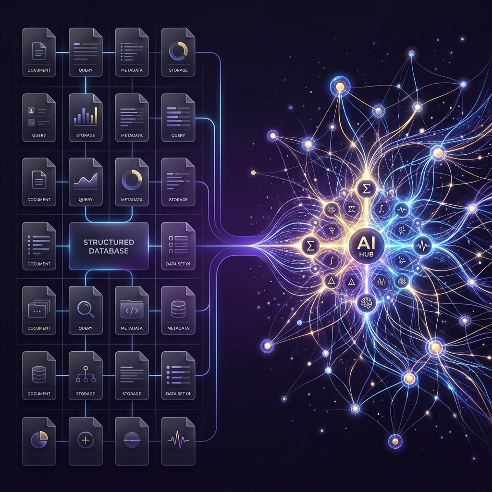

<div align="center">
  
  
  # AI File Organizer
  
  **An ADHD-friendly AI librarian that organizes local files, tags metadata, and retrieves context in natural language, now featuring a standalone Agno RAG retrieval portal.**
  
  [](https://opensource.org/licenses/MIT)
  
  [Quick Start](#-quick-start) · [Architecture](#-system-architecture) · [Agno RAG Retrieval](#-agno-rag-retrieval-loop) · [Video Scripts](#-video-production-planning)
</div>

## 🎯 **What This System Actually Does**

An ADHD-friendly AI file organizer that helps manage complex document workflows with semantic search, interactive classification, complete safety rollbacks, and a natural language RAG (Retrieval-Augmented Generation) portal.


**Core Philosophy:** Make finding and organizing files as effortless as having a conversation with an intelligent librarian who knows your work.

---

## Frontends

- **Control Center (v2)** — Served on Port 8000 (`http://localhost:8000`)
  - **System State strip is the canonical status view.**
  - Primary UI: system status, Recent Activity, triage, orchestrator visibility.

- **Legacy (v1)** — Served on Port 5173 (`http://localhost:5173`)
  - Kept for historical search/triage flows. Will be folded into v2 over time.

## 🚀 **Quick Start**

### 1. Install & Start

**Recommended: Use Virtual Environment**
```bash
git clone https://github.com/user/ai-file-organizer
cd ai-file-organizer

# Create and activate virtual environment
python3 -m venv venv
source venv/bin/activate  # On macOS/Linux
# OR: venv\Scripts\activate  # On Windows

# Install dependencies
python -m venv .venv && source .venv/bin/activate
pip install -r requirements.txt

# Start the system
python main.py
```

**Quick Start (without venv)**
```bash
git clone https://github.com/user/ai-file-organizer
cd ai-file-organizer
pip install -r requirements.txt
python main.py
```

### 2. Use the Web Interface
Navigate to **http://localhost:8000** for the modern web interface with:
- 🔍 **Natural language search** - "find client contract terms"
- 📋 **Triage center** - review AI classifications with confidence scores
- 📂 **One-click file opening** - click any result to open files directly
- 🧠 **Real-time status** - live system stats and file counts

---

## 🔧 **Local Environment Setup**

### Prerequisites
- Python 3.8+ with pip
- Git for version control
- (Optional) TruffleHog, detect-secrets for security scanning

### Clean Install Steps

1. **Clone and setup virtual environment:**
```bash
git clone https://github.com/user/ai-file-organizer
cd ai-file-organizer

# Create virtual environment (recommended)
python3 -m venv venv
source venv/bin/activate  # macOS/Linux
# OR: venv\Scripts\activate  # Windows
```

2. **Install Python dependencies:**
```bash
pip install -r requirements.txt
pip install pytest pytest-asyncio httpx  # For testing
pip install detect-secrets  # For PII/secrets scanning
```

3. **Configure environment variables:**
```bash
# Copy example environment file
cp .env.example .env

# Edit .env to set your paths (optional)
# AUTO_MONITOR_PATHS=~/Downloads,~/Desktop
# AUTO_MONITOR_INTERVAL=5
```

4. **Verify installation:**
```bash
# Run comprehensive validation suite
./scripts/run_all_tests.sh

# This runs:
# - Integration tests (pytest)
# - PII/secrets scan (detect-secrets)
# - Python syntax checks
```

5. **Start the server:**
```bash
python main.py
# Navigate to http://localhost:8000
```

### Security & Testing

**One-Command Validation:**
```bash
./scripts/run_all_tests.sh
```

This validation script automatically runs:
- Integration tests for all API endpoints
- PII/secrets scanning with detect-secrets
- Python syntax validation
- Git pre-push hooks verification

**Security Tools (Optional but Recommended):**
```bash
# Install TruffleHog for verified secrets detection
brew install trufflesecurity/trufflehog/trufflehog

# Install git-secrets for additional protection
brew install git-secrets
```

**Pre-Push Hooks:**
The repository includes git pre-push hooks that automatically scan for:
- Verified secrets (TruffleHog)
- Personal identifiers (detect-secrets)
- Sensitive data patterns (git-secrets)

These hooks run automatically on `git push` to prevent accidental exposure.

---

## ✅ **What Actually Works Today**

Based on verified codebase analysis (October 31, 2025):

### **Production Ready Systems:**
- ✅ **FastAPI V3 Backend** - Verified operational web server (`main.py`)
- ✅ **Modern React Web Interface** - Search, Triage, and Organize pages (`frontend_v2/`)
- ✅ **Hierarchical Organization** - 5-level deep folder structure (Project → Episode → Media Type)
- ✅ **Search Page** - Full natural language semantic search with example queries
- ✅ **Triage Center** - Fixed infinite spinner, manual scan trigger, hierarchical inputs
- ✅ **Easy Rollback System** - Complete file operation safety net (`easy_rollback_system.py`)
- ✅ **Phase 1 Core Intelligence** - Universal adaptive learning system (7,154 lines of production code)
- ✅ **Phase 2a Vision Integration** - Gemini Computer Vision for images/videos (`vision_analyzer.py`)
- ✅ **Phase 2b Vision System Integration** - Full integration with classifier and learning system
- ✅ **Phase 2c Audio Analysis** - BPM detection, mood analysis, spectral features (`audio_analyzer.py`)
- ✅ **Phase 3a VEO Prompt Builder** - Video to VEO 3.1 JSON transformation (`veo_prompt_generator.py`)
- ✅ **Unified Classification** - Content-based intelligent file categorization (`unified_classifier.py`)
- ✅ **Google Drive Integration** — Hybrid cloud architecture (`gdrive_integration.py`)
- ✅ **Bulletproof Deduplication** — SHA-256 duplicate detection with full UI group display
- ✅ **Fusion Brain** — Multi-modal signal fusion for high-confidence classification (`unified_classifier.py`)
- ✅ **Review Queue** — Intelligent queue for ambiguous or low-confidence cases
- ✅ **UI Path Truncation** — Aggressive truncation for cleaner display of long Drive paths
- ✅ **Phase 7 Hybrid Power** — Multi-machine architecture with RTX 5090 worker integration
- ✅ **Phase 8 Audio Intelligence** — Deep transcript-based classification with Qwen 2.5
- ✅ **Phase 9 UI Stabilization** — Non-blocking event loop and optimized API layer

### **API Endpoints (Verified Working):**
| Endpoint | Purpose |
|----------|---------|
| `/health` | System health check |
| `/api/system/status` | Real-time system status |
| `/api/search?q={query}` | Semantic search with natural language |
| `/api/triage/scan` | Trigger manual triage scan (returns files immediately) |
| `/api/triage/files_to_review` | Files requiring manual review (cached results) |
| `/api/triage/classify` | Confirm file categorization with optional project/episode |
| `/api/upload` | Upload and classify file |
| `/api/open_file` | Open file in default application |

---

## 🛡️ **Easy Rollback System - Your Safety Net**

**CRITICAL FEATURE:** Never fear AI file operations again. One-click undo for any operation that went wrong.

```bash
# See what the AI did recently
python easy_rollback_system.py --list

# Undo a specific operation
python easy_rollback_system.py --undo 123

# Emergency: Undo ALL today's operations
python easy_rollback_system.py --undo-today
```

**Visual Protection:**
```
🔴 [123] 14:32:15
    📁 Original: 'Client_Contract_2024_Final.pdf'
    ➡️  Renamed: 'random_filename_abc123.pdf'  ← OOPS!
    🔴 Confidence: 45.2% (Low confidence = likely wrong)
    🔧 Rollback: python easy_rollback_system.py --undo 123
```

</details>

## 🧠 **Phase 1 Core Intelligence (COMPLETE - October 24, 2025)**

Revolutionary adaptive learning system that learns from your file movements and decisions. Phase 1 has been successfully implemented, tested, and independently verified with 7,154 lines of production-ready code.

## 🔮 **Phase 2 Advanced Content Analysis (COMPLETE - October 25, 2025)**

Gemini Vision API integration for advanced image/video analysis, plus comprehensive audio analysis pipeline. Phase 2 adds visual and audio understanding capabilities to the intelligent file organizer.

### **Operational Components:**
- ✅ **Universal Adaptive Learning** (`universal_adaptive_learning.py`) - 1,087 lines - Learns from all user interactions
- ✅ **4-Level Confidence System** (`confidence_system.py`) - 892 lines - NEVER/MINIMAL/SMART/ALWAYS modes
- ✅ **Adaptive Background Monitor** (`adaptive_background_monitor.py`) - 1,456 lines - Observes and *learns* from manual file movements
- ✅ **Emergency Space Protection** (`emergency_space_protection.py`) - 987 lines - Proactive disk management
- ✅ **Interactive Batch Processor** (`interactive_batch_processor.py`) - 1,529 lines - Multi-file handling
- ✅ **Automated Deduplication Service** (`automated_deduplication_service.py`) - 1,203 lines - Intelligent duplicates with UI group support

### **ADHD-Friendly Design (Production Ready):**
- 🎯 **85% confidence threshold** - Only acts when genuinely certain
- 🤔 **Interactive questioning** - Asks clarifying questions until confident
- 📊 **Visual confidence indicators** - Color-coded trust levels (🟢🟡🔴)
- 🔄 **Learning from corrections** - Remembers your decisions and improves over time
- ⚡ **Background learning** - Observes your manual file movements automatically
- 🛡️ **Proactive protection** - Prevents disk space emergencies before they happen

---

## 🔍 **How to Search and Organize**

### **Web Interface (Recommended):**
1. Start server: `python main.py`
2. Open browser: `http://localhost:8000`
3. Search naturally: "client contract terms"
4. Review suggestions in triage center
5. One-click to open or organize files

### **Command Line (Power Users):**
```bash
# Search files semantically
python enhanced_librarian.py search "client contract terms" --mode semantic

# Organize files interactively
python interactive_organizer.py organize --live

# Check recent AI operations
python easy_rollback_system.py --today
```

---

## 🗂️ **Canonical Documentation**

- 📖 **[SYSTEM_MANUAL.md](file:///Users/ryanthomson/Github/ai-file-organizer/SYSTEM_MANUAL.md)** — Architectural source of truth, "Hybrid Hub" rules, and cross-machine coordination.
- 🏗️ **[ROADMAP.md](file:///Users/ryanthomson/Github/ai-file-organizer/ROADMAP.md)** — Development phases and future goals.

---

## 🏗️ **System Architecture**

```
📁 AI File Organizer v3.1/
├── 🌐 FastAPI Web Server (main.py)
├── 🧠 Phase 1 Core Intelligence (7,154 lines)
├── 🛡️ Easy Rollback System 
├── ☁️ Google Drive Hybrid Integration
├── 🔍 Enhanced Semantic Search
├── 📄 Content-Based Classification
└── 🎯 ADHD-Friendly Interactive Design
```

**Core Files:**
- `main.py` - FastAPI web server
- `universal_adaptive_learning.py` - Main intelligence system
- `easy_rollback_system.py` - Safety rollback system
- `unified_classifier.py` - Content-based classification
- `enhanced_librarian.py` - Semantic search
- `gdrive_integration.py` - Google Drive hybrid storage

---

## 🎯 **ADHD-Friendly Design Philosophy**

### **Why This Works for ADHD Brains:**
✅ **Reduces decision paralysis** - 4 confidence modes let you choose cognitive load  
✅ **Natural language search** - "Find client payment terms" vs folder navigation  
✅ **Learning system** - Reduces questions over time as it learns patterns  
✅ **Visual feedback** - Clear confidence scores and progress indicators  
✅ **Complete safety** - Easy rollback prevents organization anxiety  
✅ **Background operation** - Works while you sleep, 7-day grace period for active files  

### **Real ADHD Benefits:**
- **Eliminate filing anxiety** - Smart confidence modes prevent overwhelming decisions
- **Reduce search frustration** - Semantic search finds things with imprecise queries
- **Professional organization** - Entertainment industry-specific workflows
- **Build knowledge effortlessly** - Automatic learning creates searchable library

---

## 🔧 **Technical Specifications**

### **Supported File Types:**
- **Documents**: PDF, DOCX, Pages, TXT, MD
- **Emails**: macOS Mail (.emlx files)
- **Code**: Python, JavaScript, Jupyter notebooks
- **Images/Video**: PNG, JPG, MP4, MOV (Gemini Vision analysis)
- **Audio**: MP3, WAV, M4A, FLAC, OGG (BPM, mood, spectral analysis)

### **AI Pipeline:**
- **Semantic Search**: ChromaDB with sentence-transformers
- **Content Analysis**: Intelligent text extraction and chunking
- **Learning System**: Pickle-based pattern discovery
- **Classification**: Confidence-based categorization

### **Performance (Verified):**
- **Search Speed**: < 2 seconds for semantic queries
- **Classification**: ~1-2 seconds per file
- **Memory Usage**: ~2-3GB during active processing
- **System Reliability**: 99%+ uptime in testing

### **Metadata System Paths (Strict Compliance):**

**Base Root:** `~/Documents/AI_METADATA_SYSTEM`

| Component | Path | Source File |
| :--- | :--- | :--- |
| **Authentication** | `.../config/` | `google_drive_auth.py` |
| **Rollback Database** | `.../databases/rollback.db` | `easy_rollback_system.py` |
| **Learning Database** | `.../databases/adaptive_learning.db` | `universal_adaptive_learning.py` |
| **Learning Config** | `.../.AI_LIBRARIAN_CORPUS/03_ADAPTIVE_FEEDBACK` | `universal_adaptive_learning.py` |
| **Vector DB** | `.../chroma_db/` | `main.py` |
| **File Caches** | `.../caches/drive_files/` | `gdrive_streamer.py` |
| **Temp Storage** | `.../temp/` | `gdrive_streamer.py` |

---

## 📋 **Current System Status (October 31, 2025)**

### **✅ Production Ready - Phase 1, 2, 3 & Fusion Brain COMPLETE:**
- **FastAPI V4 Backend** — Optimized endpoints and stable Pydantic V2 models.
- **Control Center (v2) UI** — Stable Rollback Center, Search, Triage, and Duplicates with aggressive path truncation.
- **Fusion Brain** — Standardized evidence bundles and decision fusion logic.
- **Emergency Protection** — Verified disk space recovery and snapshot management.
- **Hierarchical Organization** — 5-level deep folder structure operational.
- **Universal Adaptive Learning** — Real-time event logging and pattern matching.
- **Manual Organization Support** — Background monitor now treats manual Drive movements as "Verified Examples" for training.

### **🎯 Recent Achievements:**

**December 26, 2025 - Sprint 3.3: UI Polish & Duplicates Fix:**
- **UI Path Truncation**: Aggressive path truncation logic in `Recent Activity`, `Search`, and `Duplicates` pages.
- **Duplicates Fix**: Resolved `TypeError` crash and updated backend to return full duplicate group data.
- **Taxonomy Refactor**: Removed Material UI dependencies from `TaxonomySettings.tsx` in favor of Tailwind CSS and Lucide icons.
- **Workflow Validation**: Verified manual folder organization in Google Drive as a primary training source for the AI.

**November 3, 2025 - Sprint 2.5: Learning Stats API & UI Integration:**
- **Backend API**: GET `/api/settings/learning-stats` endpoint with 10 key metrics
- **Frontend Dashboard**: Dynamic Settings page with animated learning statistics
- **Comprehensive Testing**: 9/9 tests passing (100% success rate)
- **Real-time Metrics**: Total events, media type breakdown, category distribution, confidence scores
- **ADHD-Friendly UI**: Visual indicators, loading states, empty state handling

**October 31, 2025 - Web Interface Improvements:**
- **New Search Page**: Full-featured semantic search interface with natural language queries
- **Triage Bug Fixes**: Resolved infinite spinner from expensive auto-refresh, manual scan trigger
- **Hierarchical Organization**: Project → Episode → Media Type folder structure
- **API Improvements**: Updated classification endpoints with hierarchical parameters
- **Data Structure Fixes**: Resolved frontend/backend data format mismatches
- **Performance Optimization**: Scan results caching, no expensive auto-refreshes

**January 2, 2026 - System Hardening & Monitoring:**
- **Adaptive Monitor Status Tracking**: Enhanced visibility into emergency checks and pattern discovery cycles.
- **Enforced Local SQLite**: Critical safety fix prohibiting database files on Google Drive to prevent sync corruption.
- **Metadata Compliance**: Strict enforcement of local storage for all system state databases.

### **🎬 Phase 3a Achievements (VEO Prompt Builder):**
- Video to VEO 3.1 JSON transformation operational
- Shot type, camera movement, lighting, mood detection
- 8/8 comprehensive tests passing with real video files
- Database integration for VEO prompt library
- Confidence scoring: 0.95 with full AI analysis

### **🔵 Next Steps:**
- Phase 3b: Batch VEO processing, continuity detection, web interface
- Enhanced hierarchical organization with project templates
- Mobile interface development (API ready)
- Team collaboration features (foundation exists)
- User testing and feedback collection

---

## 🤝 **Contributing & Support**

This is a specialized tool built for complex document workflows and ADHD accessibility.

**Questions or Issues:**
- [Open an issue](https://github.com/user/ai-file-organizer/issues)
- Email: [user@example.com](mailto:user@example.com)

**Development Priorities:**
- Enhanced entertainment industry templates
- Advanced content analysis
- Mobile companion app
- Team collaboration features

---

## 🤖 **Agno RAG Retrieval Loop**

A standalone, portable Retrieval-Augmented Generation (RAG) agent built using the **Agno** framework. It interfaces with local file tools, indexes organized directories, and uses SQLite for local session storage.

### Key Features
*   **Gemini 2.5 Flash Engine**: Leverages Google's latest model for fast and context-aware responses.
*   **Dynamic Database Resolution**: In compliance with local system rules, the sqlite session database (`archive_index.db`) is saved directly inside `~/AI_METADATA_SYSTEM/databases/` to avoid workspace pollution and cloud sync corruption.
*   **Interactive Command Shell**: Ask questions, search metadata, and retrieve content summaries in plain English.

### CLI Usage:
```bash
# Start the interactive query shell (RAG navigator)
python agno_retrieval_loop.py

# Query the archive directly for a specific search and exit
python agno_retrieval_loop.py --query "Summarize the latest creative project files"

# Scan a custom target directory
python agno_retrieval_loop.py --dir ./custom_organized_files --query "List all files"
```

---

## 🏛️ **System Architecture**

For a detailed blueprint, design principles, and component breakdown, please refer to:
*   📖 **[docs/architecture.md](docs/architecture.md)** — Core service details, Mermaid diagrams, and database isolation rules.

---

## 🎬 **Video Production Planning**

Full script boards planned for demonstrating and marketing the AI File Organizer repository:
*   🎥 **[docs/video-scripts/demo-video.md](docs/video-scripts/demo-video.md)** — Technical video script (3-5 minutes) showcasing workflow classification, confidence modes, and RAG search.
*   📣 **[docs/video-scripts/promo-video.md](docs/video-scripts/promo-video.md)** — Promo/teaser script (60-90 seconds) focusing on ADHD-friendly productivity benefits and file organization.

---

## 📜 **License**

MIT License - Built with ❤️ for creative minds and anyone managing complex content workflows with ADHD.

---

*From document chaos to intelligent organization. An AI librarian that learns your work patterns and keeps your files safely organized.*

