# 🤖 AI File Organizer v3.0
## Professional Entertainment Management Platform with Advanced AI

<div align="center">


[](https://www.python.org/)
[](https://www.apple.com/macos/)
[](https://ai.google.dev/)
[](LICENSE)
[](https://github.com/thebearwithabite/ai-file-organizer)

**Transform chaotic entertainment industry workflows into intelligently organized, AI-powered content management with professional-grade search, computer vision, and ADHD-friendly design.**

[🚀 Quick Start](#-quick-start) • [🎬 Entertainment Features](#-entertainment-industry-specialization) • [🧠 AI Capabilities](#-advanced-ai-pipeline) • [📖 Complete Commands](#-complete-command-reference) • [🎯 ADHD Design](#-adhd-optimized-design)

</div>

---

## 🎯 **Why This System Exists**

RT has ADHD and managing file organization is genuinely difficult. This system creates an **intelligent librarian** that:
- Knows RT and his work intimately
- Finds things quickly without perfect organization
- Helps connect related documents and ideas
- Works intuitively within macOS
- Reduces the cognitive load of staying organized

**Core Philosophy:** Make finding and organizing files as effortless as having a conversation.

## 👤 **About the User**

**Professional Roles:**
- Project Manager
- Creative Producer (AI consciousness content)
- Business Owner
- Developer (building AI tools)

**Types of Content:**
- Professional contracts and agreements
- Creative scripts and AI research papers
- Business documents (invoices, tax records, commissions)
- Email communications
- Creative project files (audio, video, documents)

**Current Projects:**
- Professional client management
- AI consciousness podcast production
- Various creative writing and media projects

---

## 🌟 What Makes This Revolutionary

This isn't just file organization - it's a **professional content management ecosystem** that learns, adapts, and evolves with complex creative workflows while maintaining ADHD-friendly simplicity.

```mermaid
graph TB
    A[🗂️ Chaotic Professional Files] --> B[🤖 AI File Organizer v3.0]
    B --> C[🧠 Semantic Understanding]
    B --> D[🎬 Computer Vision Gemini 2.5 Flash]
    B --> E[🎵 Professional Audio Analysis]
    B --> F[📚 Video Project Trainer]
    B --> G[☁️ Google Drive Integration 2TB]
    B --> H[🏷️ Comprehensive Tagging System]
    B --> I[🤔 5 Interaction Modes]
    B --> J[🔄 Revolutionary Proactive System]
    
    C --> K[📚 Professional Intelligence]
    D --> L[🖼️ Visual Content Understanding]
    E --> M[🎙️ Audio Transcription Analysis]
    F --> N[🎯 Project-Specific Learning]
    G --> O[📦 Emergency Space Recovery]
    H --> P[🔍 Multi-Source Auto-Discovery]
    I --> Q[♿ ADHD Accessibility]
    J --> R[⚡ Continuous Background Processing]
    
    K --> S[✨ Professional Content Management]
    L --> S
    M --> S
    N --> S
    O --> S
    P --> S
    Q --> S
    R --> S
```



### 🎯 **Professional Workflow Specialization**

<table>
<tr>
<td width="50%">

**💼 For Business Professionals**
- 📄 Contract and agreement management
- 🎯 Client project tracking and management
- 💰 Commission and payment tracking
- 📧 Email integration with professional contacts
- 🎯 Project-specific learning and recognition
- 🔍 Semantic search: "Find client contract terms"

</td>
<td width="50%">

**🎨 For Artistic Rersuits**
- 🎙️ Podcast production and content management
- 📚 Research organization and documentation
- 🎵 Professional audio analysis and transcription
- 🎬 Video content analysis with Gemini 2.5 Flash
- 📝 Script and creative document management
- 🧠 Intelligent content connections and discovery

</td>
</tr>
</table>

---

## 🚀 Quick Start

### Requirements
- Python 3.11+
- macOS with AppleScript support
- Node.js (for optional UI wrappers)

### Installation
```bash
git clone https://github.com/thebearwithabite/ai-file-organizer
cd ai-file-organizer
python -m venv .venv && source .venv/bin/activate
pip install -r requirements.txt
```

### First Run - Complete Setup
```bash
# 1. Set up Google Drive integration (2TB storage)
python gdrive_cli.py auth --credentials gdrive_credentials.json

# 2. Enable aggressive learning mode for rapid training
python quick_learning_mode.py --learning

# 3. Start with computer vision analysis
python vision_cli.py directory ~/Downloads --context entertainment

# 4. Organize with professional workflows
python interactive_organizer.py organize --live

# 5. Index everything with semantic search
python enhanced_librarian.py index --semantic
```

### Core Daily Workflows
```bash
# Quick search with natural language
python enhanced_librarian.py search "client payment terms" --mode semantic

# Organize with AI assistance
python interactive_organizer.py organize --live

# Check Google Drive status and emergency cleanup
python gdrive_cli.py status
python gdrive_cli.py emergency --live  # If storage is low

# Audio analysis for podcast content
python audio_cli.py search "consciousness" --type interview
```

---

## 🔄 Revolutionary Proactive Solution

### **The World's First Truly Proactive File Management System**

Unlike traditional file organizers that wait for you to act, AI File Organizer v3.0 **works while you sleep** - continuously learning, organizing, and optimizing your content ecosystem.

**🤖 Proactive Intelligence:**
```bash
# System works automatically in background
python background_monitor.py start    # Monitors all file changes 24/7
python staging_monitor.py             # Processes files after 7-day ADHD window
python gdrive_cli.py emergency --auto  # Triggers automatically when storage < 5GB
```

**What Makes This Revolutionary:**
- 🔍 **Real-Time Duplicate Detection**: Catches duplicates the moment they're created
- 🧠 **Proactive Learning**: Studies your patterns and improves classification without asking
- 📦 **Emergency Space Recovery**: Automatically frees space before you run out
- 🏷️ **Background Tagging**: Tags and indexes new content as it appears
- 📧 **Email Sync**: Continuously monitors macOS Mail for new messages
- ⚡ **Instant Search Updates**: Vector database updates in real-time

**ADHD-Friendly Proactive Design:**
- **7-Day Grace Period**: Won't touch active Desktop/Downloads files for a week
- **Confidence-Based Action**: Only acts when 85%+ certain, otherwise waits for guidance
- **Non-Intrusive Processing**: Works during idle time, never interrupts workflow
- **Smart Batching**: Processes files in small groups to prevent overwhelm

### **Proactive vs Reactive Comparison**

| Traditional File Managers | AI File Organizer v3.0 Proactive |
|---------------------------|-----------------------------------|
| ❌ Wait for manual action | ✅ Continuous background processing |
| ❌ Manual duplicate cleanup | ✅ Real-time duplicate prevention |
| ❌ Storage crises surprise you | ✅ Automatic space management |
| ❌ Manual email filing | ✅ Automatic email indexing |
| ❌ Static organization | ✅ Learning and evolving system |
| ❌ Interrupts workflow | ✅ ADHD-friendly background operation |

**Real Proactive Examples:**
- 📧 **New email arrives** → Automatically indexed and made searchable within minutes
- 🖼️ **Screenshot saved** → Computer vision analysis and smart categorization happen instantly  
- 📄 **Contract downloaded** → Duplicate check, tagging, and filing suggestion ready immediately
- 💾 **Storage getting low** → Emergency cleanup triggered before you notice
- 🎵 **Audio file added** → Transcription and content analysis begin automatically

---

## 🧠 Advanced AI Pipeline

### **🎬 Computer Vision with Gemini 2.5 Flash**
Revolutionary visual content understanding for entertainment workflows:

```bash
# Analyze entertainment industry content
python vision_cli.py analyze contract_scan.png --context entertainment
python vision_cli.py analyze video_call_screenshot.png --context creative

# Video analysis with project learning
python video_project_trainer.py analyze ~/Videos --project "thebearwithabite"
python video_project_trainer.py train --project "Papers That Dream"
```

**Computer Vision Contexts:**
- **Professional**: Optimized for contracts, business documents, client materials
- **Creative**: Focused on creative projects, AI research, podcast content
- **General**: Standard image/video analysis for all other content

### **🎵 Professional Audio Analysis**
Advanced audio processing for creative content:

```bash
# Search audio content by meaning
python audio_cli.py search "consciousness discussion" --type podcast
python audio_cli.py search "interview" --transcribe

# Analyze audio files with AI
python multimedia_cli.py analyze audio_file.mp3 --context creative
```

**Audio Capabilities:**
- **Transcription**: AI-powered speech-to-text for interviews and podcasts
- **Content Analysis**: Semantic understanding of audio topics and themes
- **Speaker Recognition**: Identify different speakers in multi-person content
- **Music vs Speech**: Automatic categorization of audio content types

### **📚 Video Project Trainer**
Learns your specific projects and improves recognition over time:

```bash
# Train on specific creative projects
python video_project_trainer.py train --project "creative-content"
python video_project_trainer.py train --project "podcast-production"
python video_project_trainer.py train --project "research-content"

# Analyze with project context
python video_project_trainer.py analyze ~/Videos --context entertainment
```

---

## 🤔 Interaction Modes & Learning System

### **5 ADHD-Optimized Interaction Modes**

```bash
# Quick mode switching
python quick_learning_mode.py --learning   # Aggressive learning (85% confidence)
python quick_learning_mode.py --smart      # Balanced operation (75% confidence)
python quick_learning_mode.py --minimal    # Minimal questions (40% confidence)
python quick_learning_mode.py --status     # Check current mode
```

| Mode | Confidence | Use Case | Questions Asked |
|------|------------|----------|-----------------|
| **LEARNING** | 85% | Rapid system training | High - teaches system your preferences |
| **SMART** | 75% | Daily operation | Moderate - asks when genuinely uncertain |
| **MINIMAL** | 40% | Quick processing | Low - only very uncertain files |
| **ALWAYS** | 100% | Maximum accuracy | Every file gets human review |
| **NEVER** | 0% | Bulk processing | Fully automatic, no interruptions |

### **Interactive Learning Examples**
```
🤖 Analyzing: entertainment_client_contract_2024.pdf

🔍 Content Preview:
   "This agreement between Management Company and Entertainment Client covers
    exclusive representation for television and film projects..."

🧠 AI Analysis:
   Category: Entertainment Industry (78% confidence)
   Client: Entertainment industry client detected
   Document Type: Management Agreement
   
❓ LEARNING QUESTION (Mode: SMART)
   This appears to be a current contract for an entertainment client.
   Should I file this under:
   1. Active Entertainment Contracts
   2. Business Operations Archive
   
✅ You chose: Active Entertainment Contracts
   Confidence updated: 95% ✅
   📝 Learning: Entertainment client contracts → Active Entertainment
```

---

## 🏷️ Comprehensive Tagging & Search System

### **Multi-Source Auto-Tagging**
```bash
# Search by intelligent tags
python tagging_cli.py search "project:entertainment,client" --match-all
python tagging_cli.py search "contract,active,entertainment"
python tagging_cli.py search "consciousness,podcast,creative"

# Auto-tag directories
python tagging_cli.py directory ~/Documents --auto-tag
python tagging_cli.py analyze "contract.pdf"  # See detected tags
```

**Auto-Detected Tag Categories:**
- **People**: `client`, `professional-contact`, `collaborator`
- **Projects**: `podcast-production`, `creative-project`, `research-content`
- **Document Types**: `contract`, `script`, `audio`, `financial`, `creative`
- **Status**: `active`, `completed`, `draft`, `archive`
- **Industry**: `professional`, `business`, `management`, `commission`

### **Advanced Search Capabilities**
```bash
# Professional semantic search
python enhanced_librarian.py search "client contract clauses" --mode semantic
python enhanced_librarian.py search "payment terms agreements" --mode hybrid

# Creative content discovery
python enhanced_librarian.py search "AI consciousness episodes" --mode auto
python enhanced_librarian.py search "creative research projects" --context creative

# Cross-reference emails and documents
python enhanced_librarian.py search "project meeting notes" --include-emails
```

---

## ☁️ Google Drive Integration & Emergency Recovery

### **2TB Cloud Storage Management**
```bash
# Check storage status
python gdrive_cli.py status
python gdrive_cli.py folders  # See organized structure

# Emergency space recovery (when local drive is full)
python gdrive_cli.py emergency --live     # Immediate cleanup and upload
python gdrive_cli.py organize --live      # Organize and sync to cloud

# Search across local + cloud
python gdrive_cli.py search --query "professional client contract"
```

**Emergency Recovery Features:**
- **Automatic Detection**: Monitors local storage and triggers when < 5GB free
- **Smart Prioritization**: Uploads older/larger files first
- **Metadata Preservation**: Maintains all tags and organization in cloud
- **Seamless Search**: Find files whether stored locally or in Google Drive

---

## 🎯 ADHD-Optimized Design Philosophy

### **Why This Works for ADHD Brains:**

✅ **Zero Decision Paralysis** - 5 interaction modes let you choose your cognitive load  
✅ **Intelligent Questioning** - System only asks when genuinely uncertain  
✅ **Learning System** - Reduces questions over time as it learns your patterns  
✅ **Natural Language Search** - "Find Client Name's payment terms" instead of folder navigation  
✅ **Batch Processing** - Handle 20 files at once with progress tracking  
✅ **Emergency Features** - Automatic space recovery prevents storage anxiety  
✅ **Context Awareness** - Understands entertainment industry terminology and workflows  
✅ **Visual Feedback** - Clear progress indicators and confidence scores  

### **Real ADHD Benefits:**
- **Eliminate Filing Anxiety**: Smart modes prevent overwhelming decisions
- **Reduce Search Frustration**: Semantic search finds things even with imprecise queries
- **Prevent Storage Panic**: Emergency Google Drive recovery handles space crises
- **Build Knowledge Effortlessly**: Automatic tagging and learning create searchable library
- **Professional Organization**: Entertainment-specific workflows reduce cognitive load

---

## 📊 System Architecture

```
🗂️  AI File Organizer v3.0 - Professional Entertainment Platform/
├── 🧠 Vector Database (ChromaDB)         # Semantic search engine
├── 📧 Email Integration (.emlx files)    # macOS Mail integration  
├── 📄 Document Processing               # PDFs, DOCX, scripts
├── 🎬 Computer Vision (Gemini 2.5 Flash) # Images and video analysis
├── 🎵 Audio AI Analysis               # Professional audio processing
├── 📚 Video Project Trainer           # Learns user's projects
├── 🔍 Smart Search Interface           # Natural language queries
├── 🍎 AppleScript GUI                  # Native macOS integration
├── 🤔 Interactive Classification       # 5 interaction modes with learning
├── 🏷️ Comprehensive Tagging System     # Multi-source auto-tagging
├── ☁️ Google Drive Integration         # 2TB cloud storage
└── 🗂️ Intelligent Organization         # Auto-categorization with learning
```

### **Core Components:**
- **`enhanced_librarian.py`** - Advanced semantic search with hybrid modes
- **`interactive_organizer.py`** - Main organization workflow with questioning
- **`vision_content_extractor.py`** - Computer vision analysis (Gemini 2.5 Flash)
- **`video_project_trainer.py`** - Learns user's specific projects
- **`interactive_classifier.py`** - 5 interaction modes (SMART, MINIMAL, LEARNING, ALWAYS, NEVER)
- **`quick_learning_mode.py`** - Easy mode switching for training
- **`tagging_cli.py`** - Comprehensive auto-tagging system
- **`gdrive_cli.py`** - Google Drive integration with emergency space recovery
- **`audio_cli.py`** - Professional audio analysis and transcription
- **`batch_cli.py`** - ADHD-friendly batch processing
- **`email_extractor.py`** - macOS Mail integration
- **`vector_librarian.py`** - Vector database operations
- **`Enhanced_Search_GUI.applescript`** - Native Mac search interface

---

## 📖 Complete Command Reference

### **🔍 Search & Discovery**
```bash
# Semantic search with professional context
python enhanced_librarian.py search "client contract terms" --mode semantic
python enhanced_librarian.py search "consciousness podcast episodes" --mode auto

# Tag-based search
python tagging_cli.py search "project:professional,client" --match-all
python tagging_cli.py search "contract,active" --context professional

# Audio content search
python audio_cli.py search "consciousness discussion" --type interview
python audio_cli.py search "creative collaboration" --transcribe
```

### **🗂️ Organization & Processing**
```bash
# Main organization workflow
python interactive_organizer.py organize --live     # Full organization
python interactive_organizer.py quick ~/Downloads --live  # Specific folder

# Batch processing (ADHD-friendly)
python batch_cli.py directory ~/Downloads --batch-size 20 --dry-run
python batch_cli.py directory ~/Documents --live --mode smart

# Learning mode control
python quick_learning_mode.py --learning  # Enable aggressive learning
python quick_learning_mode.py --smart     # Balanced operation
python quick_learning_mode.py --status    # Check current mode
```

### **🎬 Computer Vision & Media Analysis**
```bash
# Computer vision with context
python vision_cli.py analyze screenshot.png --context professional
python vision_cli.py directory ~/Downloads --limit 5 --context creative

# Video project training
python video_project_trainer.py analyze ~/Videos --project "creative-content"
python video_project_trainer.py train --project "podcast-production"

# Audio analysis
python audio_cli.py analyze podcast_episode.mp3 --transcribe
python multimedia_cli.py directory ~/Audio --context creative
```

### **☁️ Google Drive Management**
```bash
# Storage management
python gdrive_cli.py status               # Check storage usage
python gdrive_cli.py emergency --live     # Emergency space recovery
python gdrive_cli.py organize --live      # Organize and sync

# Cloud search
python gdrive_cli.py search --query "professional contract"
python gdrive_cli.py folders              # List organized structure
```

### **🏷️ Tagging & Metadata**
```bash
# Auto-tagging
python tagging_cli.py directory ~/Documents --auto-tag
python tagging_cli.py analyze contract.pdf  # See detected tags

# Metadata analysis
python metadata_cli.py analyze ~/Documents  # Extract comprehensive metadata
python metadata_cli.py search "entertainment" --detailed
```

---

## 💡 Real Usage Examples

### **Typical Professional Searches:**
- `"Client contract terms in current agreements"`
- `"Payment schedules from last quarter"`
- `"Meeting notes about current projects"`
- `"Commission reports for professional clients"`
- `"Podcast episodes about AI consciousness"`

### **What Makes This Different:**
- **Professional Context**: Understands industry terminology and workflows
- **Project Learning**: Recognizes specific creative projects and client relationships
- **Semantic Understanding**: Finds "payment terms" when document says "compensation structure"
- **Cross-Reference Intelligence**: Links contracts to email discussions to creative projects
- **ADHD-Friendly**: 5 interaction modes prevent cognitive overload

---

## 🔧 Technical Specifications

### **Supported File Types:**
- **Documents**: PDF, DOCX, Pages, TXT, MD, RTF
- **Images**: PNG, JPG, GIF, TIFF, WEBP (with Gemini 2.5 Flash computer vision)
- **Videos**: MP4, MOV, AVI, MKV (with computer vision and project recognition)
- **Audio**: MP3, WAV, FLAC, M4A, AUP3 (with AI analysis and transcription)
- **Emails**: macOS Mail (.emlx files)
- **Code**: Python, JavaScript, Jupyter notebooks, HTML, CSS
- **Creative**: Scripts, research papers, story documents

### **AI Processing Pipeline:**
- **Semantic Search**: ChromaDB with sentence-transformers for document similarity
- **Computer Vision**: Gemini 2.5 Flash for image and video analysis
- **Audio Analysis**: Professional transcription and content understanding
- **Natural Language**: Advanced query parsing and intent detection
- **Learning System**: User preference tracking with confidence adjustment

### **Performance Metrics:**
- **Search Speed**: < 2 seconds for semantic queries across 10,000+ files
- **Vision Analysis**: < 5 seconds per image with Gemini 2.5 Flash
- **Audio Processing**: Real-time transcription for podcast-length content
- **Organization**: 100-500 files per hour depending on interaction mode
- **Memory Usage**: < 4GB during active processing

---

## 🤝 Contributing

This is a specialized tool built for entertainment industry workflows and ADHD accessibility. Contributions welcome for:

### **Priority Development Areas:**
- [ ] Enhanced entertainment industry templates
- [ ] Additional creative project types
- [ ] Advanced audio analysis features
- [ ] Mobile companion app for search
- [ ] Collaborative features for team projects

### **Bug Reports:**
Include your:
- Operating system and Python version
- File types being processed
- Current interaction mode
- Full error traceback with context

---

## 📜 License

MIT License - Built with ❤️ for creative minds and producer plus anyone managing complex content workflows with ADHD.

---

## 🌟 Star This Repository

If AI File Organizer v3.0 transformed your professional workflow, **please star this repository!** ⭐

**Questions? Success stories? Feature requests?**
- [Open an issue](https://github.com/thebearwithabite/ai-file-organizer/issues)
- Email: [rt@papersthatdream.com](mailto:rt@papersthatdream.com)

**Created by:** RT Max

---

*From professional workflow chaos to AI-powered intelligent organization. The intelligent librarian that knows your work as well as you do.*
