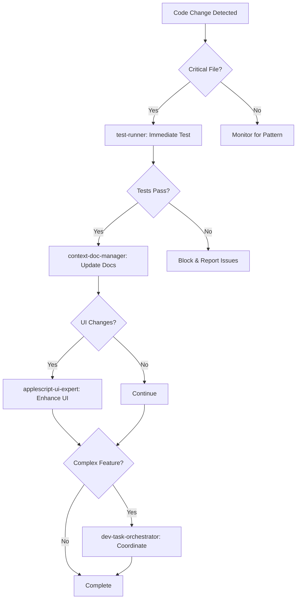

# AI File Organizer - Agent Coordination System

## Overview

This document defines the automated agent coordination system for the AI File Organizer project. Agents work proactively and synchronously without requiring explicit user commands, ensuring continuous quality assurance and documentation maintenance.

## Agent Definitions

### 🧪 test-runner
**Primary Mission**: Validate functionality and ensure quality through comprehensive testing
**Automation Level**: Fully Automated
**Priority**: Critical (P0)

**Automatic Triggers**:
- File changes in core systems: `classification_engine.py`, `interactive_organizer.py`, `enhanced_librarian.py`, `vector_librarian.py`
- Any `.py` file modifications before git commits
- AppleScript file changes (`.applescript` files)
- Google Drive integration updates (`gdrive_cli.py`)
- Audio/creative AI modifications (`audio_ai_analyzer.py`, `creative_ai_partner.py`)

**Test Execution Priority**:
1. Core functionality tests
2. Integration tests  
3. UI interaction tests
4. Performance benchmarks

**Success Criteria**:
- All existing tests pass
- New functionality has appropriate test coverage
- Performance metrics remain within acceptable bounds
- No regression in ADHD-friendly features

### 📚 context-doc-manager
**Primary Mission**: Maintain documentation consistency and project coherence
**Automation Level**: Fully Automated
**Priority**: High (P1)

**Automatic Triggers**:
- New CLI commands or tools added
- File type support extensions
- Search functionality modifications
- ADHD workflow feature updates
- Google Drive integration changes
- Audio/creative AI capability additions

**Documentation Update Targets**:
- README.md usage examples
- CLAUDE.md feature descriptions
- Command-line help documentation
- User workflow guides
- Technical architecture descriptions

**Success Criteria**:
- Documentation reflects current functionality
- Examples are up-to-date and tested
- User guidance remains ADHD-friendly
- Technical details are accurate

### 🍎 applescript-ui-expert
**Primary Mission**: Enhance macOS integration and native user experience
**Automation Level**: Triggered by UI Changes
**Priority**: High (P1)

**Automatic Triggers**:
- AppleScript GUI file modifications
- New search modes requiring UI updates
- System integration feature changes
- User workflow optimizations
- Native macOS feature integration opportunities

**Enhancement Focus**:
- Search interface improvements (`Enhanced_Search_GUI.applescript`)
- System status displays (`System_Status_GUI.applescript`)
- Menu bar integration (`AI_Organizer_MenuBar.applescript`)
- File organization workflows
- macOS accessibility features

**Success Criteria**:
- Native macOS feel maintained
- ADHD-friendly interaction patterns
- Consistent visual design
- Optimal performance and responsiveness

### 🎯 dev-task-orchestrator
**Primary Mission**: Coordinate complex development workflows and multi-component features
**Automation Level**: Context-Aware Triggering
**Priority**: Medium (P2)

**Automatic Triggers**:
- Multi-file feature implementations
- Major architectural changes
- Cross-component integrations
- System-wide ADHD workflow optimizations
- Complex feature rollouts

**Coordination Responsibilities**:
- Break down complex tasks into manageable components
- Ensure proper sequence of development activities
- Coordinate between other agents
- Monitor overall system coherence
- Manage feature rollout processes

**Success Criteria**:
- Complex features integrate smoothly
- Development processes are efficient
- No component conflicts or regressions
- ADHD-friendly principles maintained throughout

## Agent Coordination Protocol

### Execution Flow



### Synchronization Rules

1. **Sequential Dependencies**:
   - `test-runner` MUST complete successfully before other agents proceed
   - `context-doc-manager` updates documentation after successful tests
   - `applescript-ui-expert` enhances UI after documentation sync
   - `dev-task-orchestrator` coordinates final integration

2. **Parallel Execution**:
   - Documentation updates can run parallel to UI enhancements
   - Multiple test suites can run concurrently
   - Agent analysis and planning phases can overlap

3. **Failure Handling**:
   - Test failures block all downstream agents
   - Documentation inconsistencies trigger immediate fixes
   - UI issues prompt accessibility review
   - Coordination failures escalate for manual intervention

## File-Specific Agent Triggers

### Core Python Files
| File | test-runner | context-doc-manager | applescript-ui-expert | dev-task-orchestrator |
|------|-------------|---------------------|----------------------|----------------------|
| `classification_engine.py` | ✅ Always | ✅ If API changes | ❌ | ✅ If major changes |
| `interactive_organizer.py` | ✅ Always | ✅ If workflow changes | ✅ If UI impacts | ✅ Always |
| `enhanced_librarian.py` | ✅ Always | ✅ If search features | ✅ If GUI impacts | ❌ |
| `vector_librarian.py` | ✅ Always | ✅ If capabilities change | ❌ | ❌ |
| `gdrive_cli.py` | ✅ Always | ✅ Always | ❌ | ✅ If integration changes |

### AppleScript Files
| File | test-runner | context-doc-manager | applescript-ui-expert | dev-task-orchestrator |
|------|-------------|---------------------|----------------------|----------------------|
| `Enhanced_Search_GUI.applescript` | ✅ UI Tests | ✅ Usage examples | ✅ Always | ❌ |
| `System_Status_GUI.applescript` | ✅ UI Tests | ✅ Feature docs | ✅ Always | ❌ |
| `AI_Organizer_MenuBar.applescript` | ✅ UI Tests | ✅ User guide | ✅ Always | ✅ If system integration |

## Quality Gates

### Pre-Commit Requirements
All of the following must pass before any commit:
1. ✅ `test-runner`: All tests pass with ≥95% success rate
2. ✅ `context-doc-manager`: Documentation is consistent and up-to-date
3. ✅ `applescript-ui-expert`: UI changes maintain ADHD-friendly design
4. ✅ `dev-task-orchestrator`: No coordination conflicts detected

### Performance Benchmarks
- Search response time: ≤2 seconds for semantic queries
- File classification: ≤5 seconds per file
- UI responsiveness: ≤500ms for all interactions
- Memory usage: ≤200MB for typical operations

### ADHD-Friendly Validation
- Decision points limited to binary choices
- Confidence thresholds maintained (85%)
- Visual feedback clear and immediate
- Cognitive load minimized in all interactions

## Agent Communication Protocol

### Status Reporting
```json
{
  "agent": "test-runner",
  "timestamp": "2025-08-29T10:30:00Z",
  "status": "completed",
  "trigger": "file_change:classification_engine.py",
  "results": {
    "tests_passed": 47,
    "tests_failed": 0,
    "coverage": 94.2,
    "duration": "12.3s"
  },
  "next_agents": ["context-doc-manager"]
}
```

### Coordination Messages
Agents communicate through structured messages to coordinate handoffs:
- **Initiation**: Announce start of work with expected completion time
- **Progress**: Regular status updates during long-running tasks  
- **Completion**: Final results and recommendations for next agents
- **Blocking**: Alert when issues prevent progress

## Monitoring and Metrics

### Agent Performance Tracking
- **Response Time**: How quickly agents trigger after events
- **Success Rate**: Percentage of successful completions
- **False Positives**: Unnecessary triggering events
- **Coverage**: Percentage of code changes that trigger appropriate agents

### System Health Indicators  
- **Test Coverage**: Maintained at ≥90% for core functionality
- **Documentation Freshness**: ≤24 hours lag for critical updates
- **UI Consistency**: 100% compliance with ADHD-friendly design principles
- **Integration Stability**: Zero breaking changes to user workflows

## Emergency Protocols

### Agent Failure Response
1. **Test Failures**: Block all commits, notify immediately
2. **Documentation Drift**: Auto-generate placeholder updates
3. **UI Regressions**: Revert to last known good state
4. **Coordination Deadlocks**: Escalate to manual resolution

### Recovery Procedures
- Automated rollback for non-critical agent failures
- Manual intervention protocols for critical system components
- Backup agent configurations for rapid restoration
- User notification system for service interruptions

---

*Last Updated: 2025-08-29*
*Version: 1.0 - Initial Agent Coordination System*