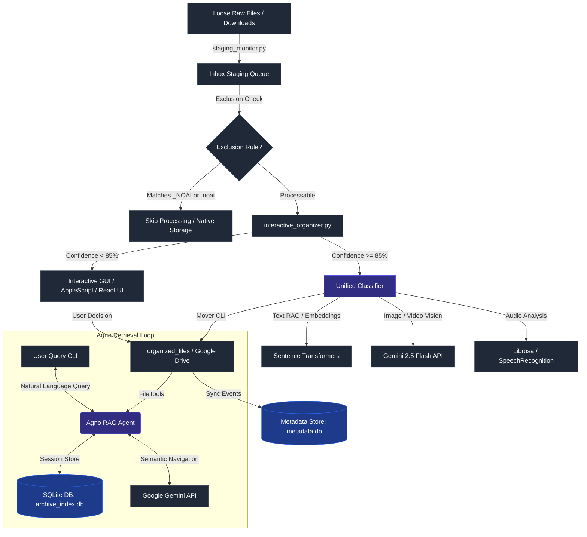

# System Architecture & Design

This document details the architectural design, security protocols, and data pathways for the **AI File Organizer**. It is written for engineers, contributors, and forks looking to understand the technical implementation and design decisions.

---

## Architecture Blueprint

The AI File Organizer integrates local file operations, metadata tracking, machine learning models, and Google Drive cloud streaming. 

---

## Core Components

### 1. Unified Classification Service (`unified_classifier.py`)
Consolidates the classification logic across three primary media vectors:
*   **Text/Document Analysis**: Extracts content from PDF, DOCX, and XLSX files, generating semantic embeddings via `sentence-transformers`.
*   **Vision Analysis**: Integrates the Gemini 2.5 Flash API for computer vision processing of screenshots, diagrams, and video files.
*   **Audio Analysis**: Leverages `librosa` for audio spectral analysis (detecting BPM, spectral centroid, and texture) and `SpeechRecognition` for transcription.

### 2. Metadata Service (`metadata_service.py`)
Acts as the unified source of truth for the file organization history. Every file operation (classification, renaming, location movement) writes a record into a local SQLite database and generates individual sidecar files, facilitating quick rollbacks.

### 3. Exclusion Protocol (`_NOAI`)
Ensures data security and repository boundary safety:
*   **Folder Boundaries**: Skips directories and subdirectories matching suffix/prefix `_NOAI` or `_NO_AI`.
*   **Marker Boundaries**: Skips any folder containing a `.noai` or `.no_ai` file, including all its recursive children.

### 4. Agno Retrieval Loop (`agno_retrieval_loop.py`)
A standalone RAG agent designed using the **Agno** framework:
*   **Engine**: Backed by `Gemini 2.5 Flash`.
*   **Indexing**: Uses Agno's `FileTools` to list, read, and search the target `./organized_files` directory.
*   **Local Session Storage**: Utilizes `SqliteDb` to store agent conversations and runs.

---

## Technical Design Decisions

### SQLite & SQLite Sidecars
Instead of relying on large-scale databases, the application uses local SQLite files. This decision ensures that:
1.  The project remains 100% portable for open-source forks.
2.  File movements can be registered instantly without complex database servers.
3.  Sidecar files (`.meta.json`) preserve metadata in-place next to user files.

### Explicit Database Placement (Security Rule 3)
To prevent cluttering of workspaces and cloud sync conflicts, **all databases, caches, and learning artifacts are strictly restricted from being saved outside of the centralized system directory**:
*   **Ryan's System**: `/Users/ryanthomson/AI_METADATA_SYSTEM`
*   **General Systems (Forks)**: `~/AI_METADATA_SYSTEM`

This is enforced across the path configuration module (`path_config.py`) and inside the Agno retrieval loop script.

### ADHD-Friendly Workflows
The interactive layer is structured specifically to minimize decision fatigue:
*   **Confidence Gate**: Decisions are made automatically if the AI confidence matches or exceeds **85%**.
*   **Binary Prompts**: When the system requires user review, it offers binary prompts (yes/no or pick one of two categories) rather than overwhelming option structures.
*   **Native macOS GUI Integration**: AppleScripts generate native dialogs, reducing context switching and keeping interactions smooth.
